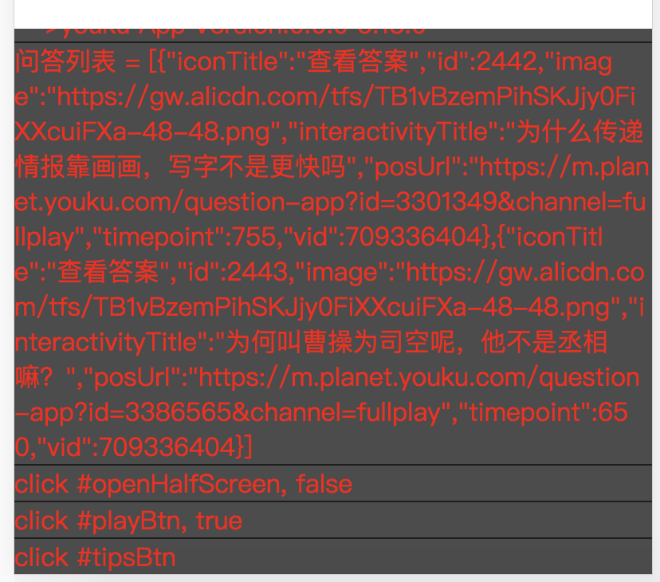
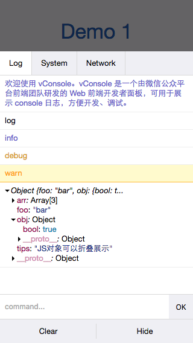

## 一、简单实现

替换window.console.log方法，在document上创建Dom用于显示console.log。log输出

```js
createConsole(height) {
  height = parseInt(height);
  if (!height) return;

  const historyHeight = height;
  const consoleId = '_ConsoleId_' + Math.floor(Math.random() * 100);
  const consoleDom = `<div id="${consoleId}" style="position:fixed;left:0;bottom:0;width:100%;height:${height}%;overflow:scroll;background:rgba(0,0,0,.7);word-break:break-all;color:#f00;"></div>`;
  document.body.insertAdjacentHTML('beforeend', consoleDom);

  const $console = document.getElementById(consoleId);
  $console.addEventListener('click', e => {
    $console.style.height = (height = height === historyHeight ? 5 : historyHeight) + '%';
  }, false);

  if (!window.console) window.console = {};
  window.console.log = function() {
    const args = [];
    for (let i = 0; i < arguments.length; i++) {
      const arg = arguments[i];
      args.push(typeof arg === 'object' ? JSON.stringify(arg) : arg);
    }
    const msg = `<div style="border-top:1px solid rgba(0,0,0,.6);">${args.join(', ')}</div>`;
    $console.insertAdjacentHTML('beforeend', msg);
  };
}

// 使用
console.log('这里是输出', '输出二', '输出N')    // 这里是输出, 输出二, 输出N
```

输出的UI格式如下图，支持点击变小以及重新变大。



## 二、更全面功能版本

可以看这几个：

### 2.1 [vConsole](https://github.com/Tencent/vConsole)，[Demo](http://wechatfe.github.io/vconsole/demo.html)

使用时需要在目标页面中引入对应JS文件。



### 2.2 [spy-debug](https://github.com/wuchangming/spy-debugger)

使用时给设备设置浏览器/网络代理就可以使用。

