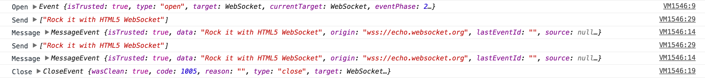

使用 JS [Proxy](https://developer.mozilla.org/en/docs/Web/JavaScript/Reference/Global_Objects/Proxy)对象调试[WebSocket](https://developer.mozilla.org/en/docs/Web/API/WebSocket)连接很容易，而且只需要很少的代码。

## 例子

```javascript
// proxy the window.WebSocket object
var WebSocketProxy = new Proxy(window.WebSocket, {  
  construct: function(target, args) {
    // create WebSocket instance
    const instance = new target(...args);
    // return the WebSocket instance
    return instance;
  }
});

// replace the native WebSocket with the proxy
window.WebSocket = WebSocketProxy;  
```

这里为`new`操作员添加了一个诱捕点，以便在`new WebSocket(...)`调用时我们可以手动创建一个新的 WebSocket 实例。

```javascript
// proxy the window.WebSocket object
var WebSocketProxy = new Proxy(window.WebSocket, {  
  construct: function(target, args) {
    // create WebSocket instance
    const instance = new target(...args);

    // WebSocket "onopen" handler
    const openHandler = (event) => {
      console.log('Open', event);
    };

    // WebSocket "onmessage" handler
    const messageHandler = (event) => {
      console.log('Message', event);
    };

    // WebSocket "onclose" handler
    const closeHandler = (event) => {
      console.log('Close', event);
      // remove event listeners
      instance.removeEventListener('open', openHandler);
      instance.removeEventListener('message', messageHandler);
      instance.removeEventListener('close', closeHandler);
    };  

    // add event listeners
    instance.addEventListener('open', openHandler);
    instance.addEventListener('message', messageHandler);
    instance.addEventListener('close', closeHandler);

    // proxy the WebSocket.send() function
    const sendProxy = new Proxy(instance.send, {
      apply: function(target, thisArg, args) {
        console.log('Send', args);
        target.apply(thisArg, args);
      }
    });

    // replace the native send function with the proxy
    instance.send = sendProxy;

    // return the WebSocket instance
    return instance;
  }
});

// replace the native WebSocket with the proxy
window.WebSocket = WebSocketProxy;  
```

**示例输出：**
