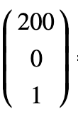

### matrix()示例

介绍完基本向量和矩阵的知识后，我们来看看transform的matrix()应用举例，transform:matrix(a,b,c,d,tx,ty)一共六个参数，用矩阵表示如下图所示：


注：参数书写的方向是竖着写的。

这六个参数代表什么意思，这里先不做介绍，稍后会详细介绍，我们先从一个例子的应用来讲起，现在我们有这样一个元素，其对应的CSS属性如下：

```css
#transformedObject {
     position: absolute;
     left: 0px;
     top: 0px;
     width: 200px;
     height: 80px;
}
```

此段代码，对应的页面效果如下：


从此图我们可以看出，此长方形的四个顶点从左上顺时针分别为：(0,0),(200,0),(200,80),(0,80),我们对其进行transform:matrix(0.9, -0.05, -0.375, 1.375, 220, 20)的变换，css代码如下：

```css
#transformedObject {
     position: absolute;
     left: 0px;
     top: 0px;
     width: 200px;
     height: 80px;
     transform:  matrix(0.9, -0.05, -0.375, 1.375, 220, 20);
     transform-origin: 0 0;
}
```

注：transform-origin是变形原点，也就是该元素围绕着那个点变形或旋转，该属性只有在设置了transform属性的时候起作用；

应用变换后的效果如下图


这四个点的值，是怎么得出来的呢，其实有了前面的向量和矩阵知识，我们很容易算出，matrix(0.9, -0.05, -0.375, 1.375, 220, 20)对应的矩阵如下图：


元素最初的每个点相当一个向量，例如(200,0)可表示如下图：



变换后的四个点，其实是matrix(0.9, -0.05, -0.375, 1.375, 220, 20)对应的矩阵与原始四个点对应的向量分别相乘而得，具体的运算过程如下图：

与(200, 80)相乘的运算过程得到(370,120)：


与(200, 0)相乘得到(400,10)：


与(0, 80)相乘得到(190,130)：


与(0,0)相乘得到(220,20)：


经过运算后，我们最终变换后的四个点: (220,20)，(400,10)，(370,120)，(190,130)

### matrix参数详细介绍

上一小节，我们学习了如何利用向量和矩阵的知识，我们算出了元素经过matrix()变换后的最终结果，现在我们详细介绍下transform:matrix(a,b,c,d,tx,ty)这六个参数的意义，其实这六个参数，对应的是translate(x,y)，scale(x,y)，rotate(angle)，skew(x-angle,y-angle)这些效果,每种变换效果对应的参数不同，如下图总结:


假如我们对元素进行旋转15度，往右动230px, X轴方向延长1.5倍，我们使用基本的变换属性代码下：

```css
#o1 {
   transform-origin: 0px 0px;
   transform: rotate(15deg) translateX(230px) scaleX(1.5);
}
```

如果用transform:matrix()怎么实现如上的最终效果，其实我们可以利用笔者针对transform:matrix(a,b,c,d,tx,ty)这六个参数对应的总结（如上图）,其实就是每个变换对应的矩阵参数相乘的结果得到这6个参数值，记住一定要按照rotate，translateX，scaleX对应的顺序进行举行相乘，如下图所示(运算的结果笔者就不写了，留给大家练习下矩阵相乘)

