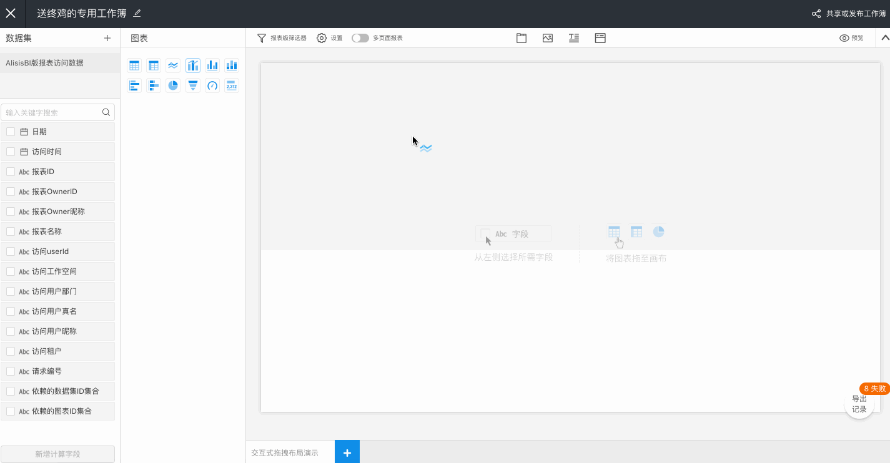
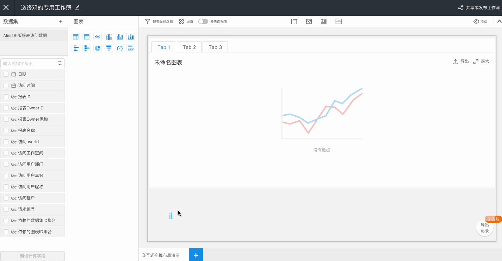
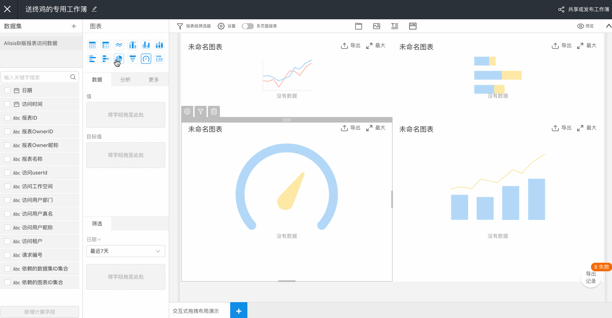
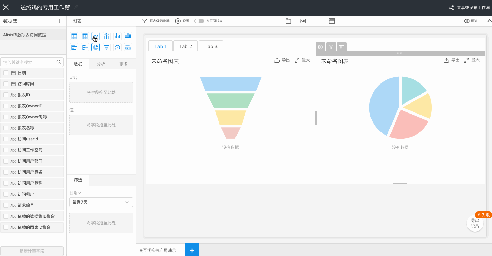
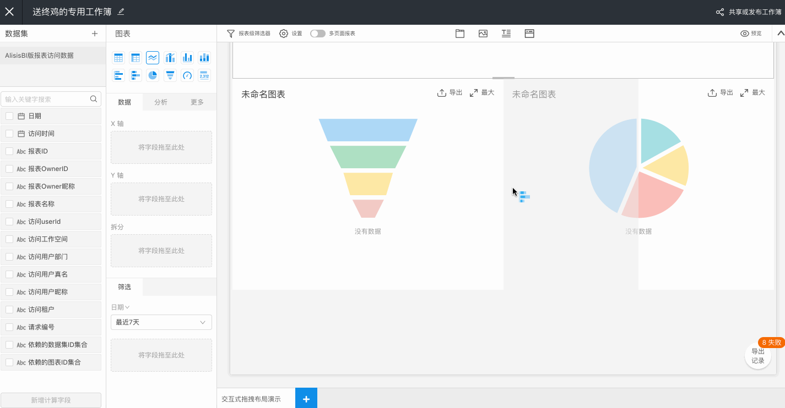
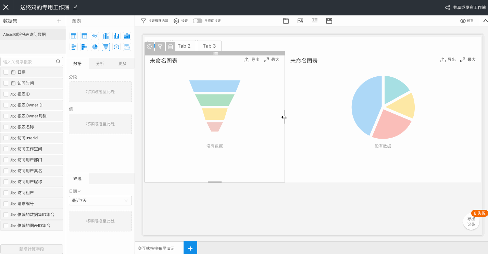
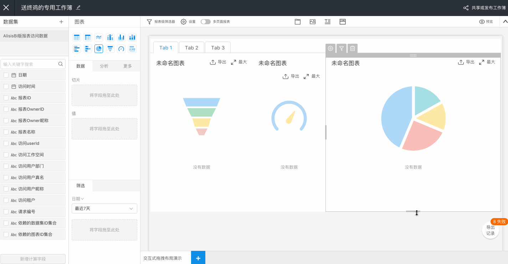

# 一种简单的拖拽布局实现思路

拖拽布局在一些可视化建站的产品中很常见。

这里给大家介绍一下我们使用的一种交互式拖拽布局思路。

在之前一个项目中的拖拽布局中，我们的画布具备这些能力：

- 拖拽组件进入画布
- 组件布局从上往下排布
- 组件间可拖拽交换位置
- 交换位置时具备切换动效

看下实际效果：


但这个方案存在一些不足：

- 需要左右多个栅格布局的时候，得手动拖进一个栅格组件
- 栅格比例需要手动配置
- 高度无法定制

更灵活的一种方式是什么：

- 栅格根据拖拽自动生成(不想列布局的时候还要手动拖拽栅格容器进来)
- 栅格比例可拖拽调整(随意拖动又可对齐)
- 高度可拖拽调整(关联组件高度自适应)

除此之外，还要考虑：

- 拖拽的占位图是否清晰暗示了拖拽结果
- 高度调整是否自适应其他组件(容器类和非容器类组件)

为了提升拖拽布局的交互体验，我们采用了新的交互形态和技术实现。

下面介绍实现这个新的拖拽方案的一些实现思路。

## 拖拽目标区域检测

在旧版的拖拽中，我们实现的是拖拽结果直接预览的方式：


可以看到，这种实现只提供组件从上往下排布的布局方式，所以直接做到了拖拽结果预览。
而为了实现这种拖拽结果预览，以及拖拽交换位置的动画，需要在拖拽的过程中生成组件制作动画效果，这带来了闪动的问题，也带来了一些动画过程不可控的问题(还需要在背后生成冗余的对应的 placeholder DOM)。

为了自由实现上下左右的拖拽布局，需要给用户更好的预览提示。所以在新版的拖拽中，我们舍弃了这种花俏的实现，改为简单的拖拽区域阴影高亮目标区域。



拖拽 Source 组件进入画布时，dragOver 时与 Target 组件产生碰撞

- 若 Target 为容器组件，则判断容器类型
  - full: 若 Target 为空容器，则为通栏插入 
  - append: 若 Target 为非空容器，则在容器中追加 
- 若 Target 为非容器组件，则根据边界检测，判断插入的位置
  - innerTop: 顶部二分高度 
  - innerBottom: 底部二分高度 - innerLeft: 左侧二分宽度 
  - innerRight 右侧二分宽度 
  - outerTop: 外顶部插入通栏 
  - outerBottom: 外底部插入通栏 

## 插入新组件

需要考虑以下不同类型的插入。

### 通栏内置插入

目标区域为：

- full
- append

Target 为 Tabs/Accordion 等组件容器时，在容器内插入或附加 Source 组件，这时候 Source 插入后使用默认高度，将 Target 容器组件撑高。

- 插入前结构：

```
<Target>
    {/*  插入位置: full */}
</Target>

```

- 插入后结构：

```
<Target>
    {/* 插入位置: full */}
    <Source />
</Target>

```

> Tips：Tabs/Accordion 类组件结构有特殊，如 Tabs 内有 TabPanel，Accordion 内有 AccordionPanel，需要特殊处理插入节点。

### 通栏外部插入

目标区域为：

- outerTop
- outerBottom

Target 为栅格内组件，则需要找到最近的通栏组件前后插入。

- 插入前结构：

```html
<Container>
    <Row>
        <Col>{/* 一些组件 */}</Col>
        <Col>
            <A />
            <B />
            <Target />
        </Col>  
        <Col>{/* 一些组件 */}</Col>
    </Row>  
</Container>

```

- 插入后结构：

```html
<Container>
    <Row>
        <Col>{/* 一些组件 */}</Col>     
        <Col>
            <A />
            <B />
            <Target />
        </Col>  
        {/*  插入位置: outerBottom */}
        <Col>{/* 一些组件 */}</Col>
    </Row>
    <Source />
</Container>

```

### 生成栅格

目标区域为：

- innerLeft
- innerRight

为避免产生冗余的 div, 所以当 Target 为通栏组件时，是不使用栅格包裹，而当其需要与拖入的 Source 组件并列时，生成栅格。

- 插入前结构：

```
<Container>
    <Target />
</Container>

```

- 插入后结构：

```
<Container>
    <Row>
        <Col span="12">
            {/*  插入位置: innerLeft */}
            <Source />
        </Col>
        <Col span="12">
            <Target />
        </Col>
    </Row>
</Container>

```

### 拆分栅格

目标区域为：

- innerLeft
- innerRight

为了不产生嵌套的div, 所以当 Target 为栅格内组件时，则复用已有的栅格，进行二次拆分。

- 插入前结构：

```
<Container>
    <Row>
        <Col span="4">{/* 一些组件 */}</Col>
        <Col span="12">
            <Target />
        </Col>
        <Col span="8">{/* 一些组件 */}</Col>
    </Row>
</Container>

```

- 插入后结构：

```
<Container>
    <Row>
        <Col span="4">{/* 一些组件 */}</Col>
        <Col span="6">
            {/*  插入位置: innerLeft */}
            <Source />
        </Col>
        <Col span="6">
            <Target />
        </Col>
        <Col span="8">{/* 一些组件 */}</Col>
    </Row>
</Container>

```

### 拆分高度

目标区域为：

- innerTop
- innetBottom

在 innerLeft 和 innerRight 场景下通过栅格二分来拆分宽度，而在 innerTop 和 innerBottom 时，则需要计算 Target 的高度进行拆分，设置新的 Target 和 Source 的高度为旧的 Target 的二分之一高度。

- 插入前结构：

```jsx
<Container>
    <Row>
        <Col span="4">{/* 一些组件 */}</Col>
        <Col span="12">
            <Target height={100} />     
        </Col>
        <Col span="8">{/* 一些组件 */}</Col>
    </Row>
</Container>

```

插入后结构：

```jsx
<Container>
    <Row>
        <Col span="4">{/* 一些组件 */}</Col>
        <Col span="12">
            {/*  插入位置: innerTop */}
            <Source height={50} />
            <Target height={50} />
        </Col>
        <Col span="8">{/* 一些组件 */}</Col>
    </Row>
</Container>
```

## 拖拽调整组件宽高

### 调整栅格宽度

通栏组件占满画布宽度，栅格组件则按栅格规则均分画布宽度，栅格总数为 24。

最小栅格数需要做限制，如小于 4 栅格的组件，不允许再被拆分，也就是禁止掉 innerLeft 和 innerRight 的插入位置。

栅格满一个算一个，否则丢弃。



### 调整组件高度

非容器类组件，配置拖拽改变高度的句柄，允许拖拽调整高度。

容器类型组件如 Tabs/Accordion 组件，作为容器组件，高度为容器内组件撑高的高度，所以不配置写死的内联高度，不参与高度配平。


## 高度配平

新组件插入栅格、拖拽改变位置、拖拽改变高度时，进行高度配平，以保证同一行内的栅格高度等同，避免出现参差不齐的情况。

### 新增组件插入栅格

目标区域为：
\- innerTop
\- innetBottom

- 插入前结构：` <Container> <Row> <Col>{/* 一些组件 */}</Col> <Col> <Target height={100} /> </Col> </Row> </Container> `
- 插入后结构：` <Container> <Row> <Col>{/* 一些组件 */}</Col> <Col> {/* 插入位置: innerLeft */} <Source height={100} /> </Col> <Col> <Target height={100} /> </Col> </Row> </Container> `

### 拖拽改变高度

拖拽改变位置时，Source 的位置以 Target 位置为基准。

- 拖拽前结构：

  ```jsx
  <Container>
  <Row>
      <Col>{/* 一些组件 */}</Col>
      <Col>
          <Target height={100} />
      </Col>
  </Row>
  <Source />
  </Container>
  ```

- 拖拽后结构：

  ```jsx
  <Container>
  <Row>
      <Col>{/* 一些组件 */}</Col>
      <Col>
          <Target height={100} />
      </Col>
      <Col>
          {/*  插入位置: innerRight */}
          <Source height={100} />
      </Col>
  </Row>
  </Container>
  ```

  

### 拖拽改变高度

拖拽改变高度时，Source 组件高度变更后，计算该组件所在的栅格总高度，然后遍历关联栅格，对关联栅格内的组件进行等比的高度配平。


### 删除改变高度

删除改变高度时，以一个关联栅格总高度为基准，遍历当前栅格，对当前栅格内的组件进行等比的高度配平。


## 删除组件后清理栅格

拒绝使用冗余的标签结构，同时也要及时清理冗余的标签，比如删除的时候。

- 合并栅格

删除前结构：

```jsx
<Container>
    <Row>
        <Col span="6">{/* 一些组件 */}</Col>
        <Col span="6">
            <Source />
        </Col>
        <Col span="12">{/* 一些组件 */}</Col>
    </Row>
</Container>
```

删除后结构：

```jsx
<Container>
    <Row>
        <Col span="12">{/* 一些组件 */}</Col>
        <Col span="12">{/* 一些组件 */}</Col>
    </Row>
</Container>

```

- 取消栅格

删除前结构：

```
<Container>
    <Row>
        <Col span="8">
            <Source />
        </Col>
        <Col span="16">
            <Target />
        </Col>  
    </Row>
</Container>

```

删除后结构：

```
<Container>
    <Target />
</Container>

```

## 总结

以上这种拖拽方案的特点是：

- 栅格的自动生成、拆分、合并、清理
- 栅格拖拽调整宽度
- 组件拖拽调整高度，高度自适应

一言以蔽之：实现拖拽布局，无非就是对姿势和尺寸的精准把控 :)

感谢阅读！