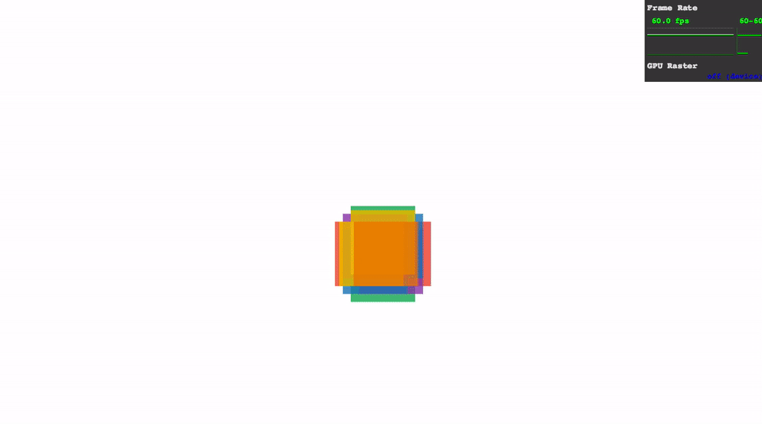
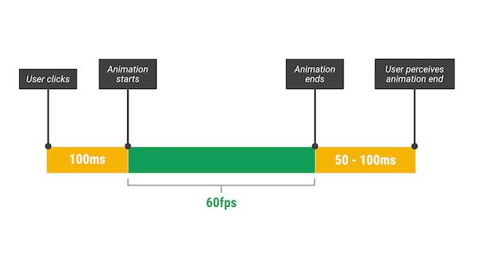

CSS 动画已经存在很多年了，使用恰当可以很好地提高网站的用户体验，也正是由于其容易使用，就很可能出现性能低下的动画，从而降低了整个页面的运行效率。回想一下：你曾经是否使用过 CSS 来改变元素的宽度、高度或绝对位置？如果回答是肯定的，就意味着你触发了性能低下的重排或重绘计算，在某些情况下甚至可能导致页面闪烁。

什么样的情况会导致页面闪烁呢？现代浏览器根据设备的刷新率来刷新页面中的内容，对大多数设备而言，屏幕以 `60` 次每秒的频率刷新，即 `60HZ`。如果在屏幕上出现了某些运动，如滚动、过渡或动画，浏览器应该每秒刷新 `60` 帧，如果某些帧花费的时间太长，进而导致浏览器的刷新频率跟不上设备的刷新频率（跳帧现象），就会出现页面闪烁。**所以在 Web 应用中运行的动画都应该保持在 60FPS 下**。

为了生成流畅的动画，你需要让浏览器尽可能少地工作，最好的办法就是充分利用 GPU，并避免动画过程中触发页面重排或重绘。目前 Chrome，Firefox，Safari，Opera 和 IE11 都对 `transform`（`translate`，`rotate` 和 `scale`） 和 `opacity` 进行硬件加速。**所以我们应该尽量使用 transform 和 opacity 属性来实现我们的动画**，因为改变其他属性都可能导致页面[重排或重绘](https://csstriggers.com/)。**还有最好在绝对定位的元素上使用动画**，因为这些元素位置的改变不会影响其他元素。只要严格遵循以上两条规则，就能确保在绝大多数情况下你的动画在 `60FPS` 下运行。这还不是全部，下面将介绍一个新的技术方案，可以帮助你创建真正轻量级的动画。

## 什么是 FLIP 技术

FLIP 是将一些开销高昂的动画，如针对 `width`，`height`，`left` 或 `top` 的动画，映射为 transform 动画。通过记录元素的两个快照，一个是元素的初始位置（First - `F`），另一个是元素的最终位置（Last - `L`），然后对元素使用一个 `transform` 变换来反转（Invert -`I`），让元素看起来还在初始位置，最后移除元素上的 `transform` 使元素由初始位置运动（Play - `P`）到最终位置。

所以 FLIP 来源于 **F**irst，**L**ast，**I**nvert，**P**lay。

分解一下：

- **First**：元素的初始状态。
- **Last**：元素的最终状态。
- **Invert**：先计算出从初始状态到最终状态元素发生的改变，比如宽度、高度、透明度等，然后在元素上应用一个 `transform` 或 `opacity` 使这些改变反转。如果一个元素由初始状态到最终状态是向下移动了 `90px`，那就需要对元素应用 `transform: translate(0, -90px)`，这样就使元素看起来还在初始位置。
- **Play**：移除元素上的 `transform` 并设置 `transform` 相关的动画。

那为什么是删除元素中的 `transform` 而不是直接应用一个 `transform` 使元素由初始位置运动到最终位置呢？从上面的 **Invert** 可知元素其实已经在最终状态上，而且通过应用反转浏览器就已经知道从 `F` 到 `L` 的过程，对浏览器来说就能更快地启动动画。

## JS 实现

思路已经很清晰，直接看实现代码：

```js
// 获取初始位置
var first = el.getBoundingClientRect();

// 为元素指定一个样式，让元素在最终位置上
el.classList.add('totes-at-the-end');

// 获取最终位置
var last = el.getBoundingClientRect();

// 如果有必要也可以对其他样式进行计算，但最好坚持只进行 transform 和 opacity 相关的计算
var invert = first.top - last.top;

// 反转
el.style.transform = 'translateY(' + invert + 'px)';

// 等到下一帧，也就是其他所有的样式都已经被应用
requestAnimationFrame(function() {

  // 添加动画相关的设置 
  el.classList.add('animate-on-transforms');

  // 开始动画
  el.style.transform = '';
});

// 结束时清理
el.addEventListener('transitionend', tidyUpAnimations);
```

也可以使用 [Web Animations API](http://w3c.github.io/web-animations/)，代码更加简单：

```js
// 获取初始位置
var first = el.getBoundingClientRect();

// 为元素指定一个样式，让元素在最终位置上
el.classList.add('totes-at-the-end');

// 获取最终位置
var last = el.getBoundingClientRect();

// 反转
var invert = first.top - last.top;

// 应用动画
var player = el.animate([
  { transform: 'translateY(' + invert + 'px)' },
  { transform: 'translateY(0)' }
], {
  duration: 300,
  easing: 'cubic-bezier(0,0,0.32,1)',
});

// 结束时清理
player.addEventListener('finish', tidyUpAnimations);
```

如果运行上面的代码你可以需要 [Web Animations API polyfill](https://github.com/web-animations/web-animations-js) 这个兼容模块，这个模块很轻量，但确实让代码好看了很多。

Chrome 团队已经将以上方案封装为一个独立的 JS 模块 - [flipjs](https://github.com/GoogleChrome/flipjs)，并提供了几个 [Demo](https://googlechrome.github.io/flipjs/)。

## CSS 实现

[ANNA MIGAS](http://blog.lunarlogic.io/author/ania/) 知道 FLIP 技术后，封装了一个轻量级的 CSS 动画模块 - [repaintless.css](https://github.com/szynszyliszys/repaintless)，用于实现某些 FLIP 动画，并在其[文章](http://blog.lunarlogic.io/2016/boost-your-css-animation-performance-with-repaintless-css/)中演示了 FLIP 的性能。

使用 repaintless.css 实现 60FPS 动画

## 这到底有什么好处？

先陈述一个事实，当用户与你的网站进行交互，从交互结束到感知到响应大概需要 `100ms` 的生理反应时间，如果网站能在这 `100ms` 内做出响应，那么对用户来说就相当于网站立即进行了响应，然后只需要保证动画在 60FPS 运行就能给用户带来最佳的体验。



我们可以充分利用用户 `100ms` 生理反应时间来进行相关的计算：`getBoundingClientRect`或 `getComputedStyle`，并通过 FLIP 技术使动画尽快开始，最后通过 `transform` 和 `opacity` 的动画来保证动画的平滑运行。可以深入阅读 [Pixels are Expensive](https://aerotwist.com/blog/pixels-are-expensive/) 了解更多。

那些可以映射为 `transform` 和 `opacity` 的属性变换都可以使用该解决方案，并且在设计阶段也应该尽量使动画满足这个方案（还记得文章开始提到关于动画的两个原则吗？）。

你也许会觉得这是过度设计，但对我来说却不是：

1. **用户需要**。Google 的 Paul Kinlan 最近做了一个[调研](http://paul.kinlan.me/what-news-readers-want/)，是关于用户对新闻类 APP 最期待什么样的功能。回答令人惊讶，最多的声音不是离线支持，不是平台间同步，不是更好的通知方式，或类似功能方面的改进，而是希望使用起来更加**平滑**。平滑就意味着没有屏幕闪烁，没有卡顿，没有抖动。
2. **移动端需要**。FLIP 技术带来的改变对于 PC 端可能并不是那么明显，但对于 CPU 并不算非常强大的移动端却是相当显著。

## 几点提示

使用 FLIP 技术时有几点需要牢记：

1. 不要超出用户反应时间 `100ms`。否则用户会觉得你的应用没有立即响应，通过 DevTools 时刻留意是哪些计算导致超出了这个时间。
2. 精心组织你的动画。设想一下，如果一个 FLIP 动画正在运行，同时你接着想执行下一个 FLIP 动画，这时就要确保下一个动画的预计算工作是在闲置或用户的反应时间内进行，这样就可以保证两个动画互不影响。
3. 内容可能被扭曲。当进行某些缩放动画时可能导致内容扭曲，毕竟这是一种 Hack 技术。