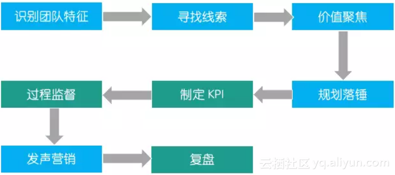
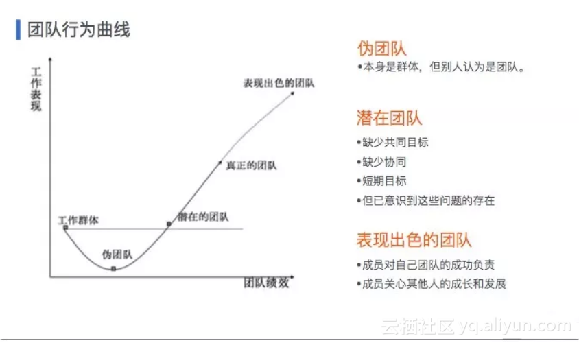
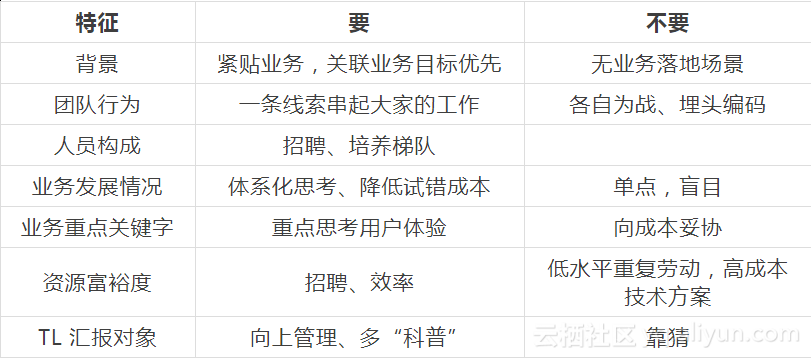
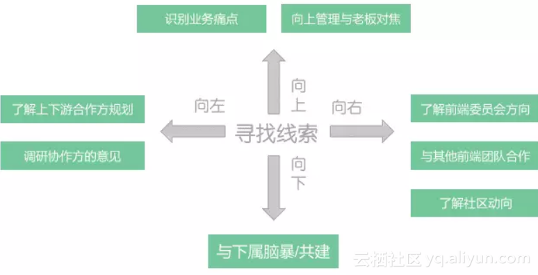
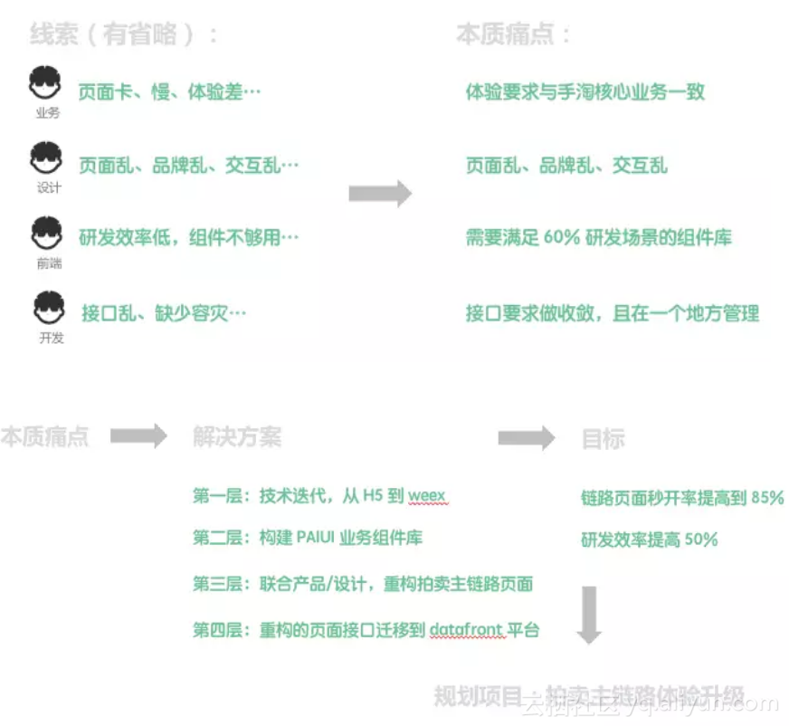
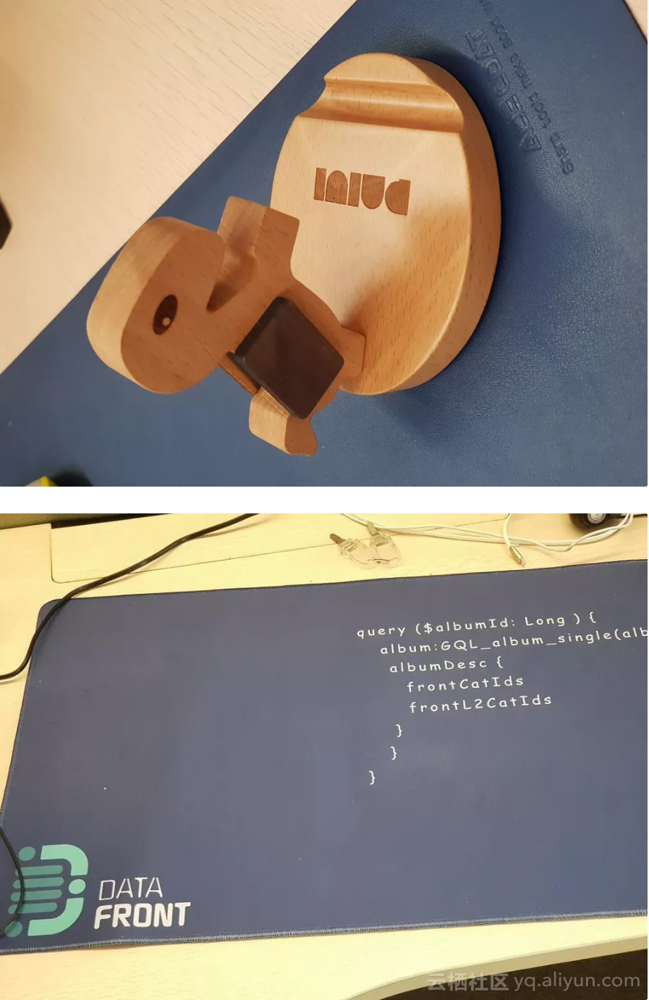

+++
title = "前端Leader如何做好团队规划"
template = "page.html"
date = "2019-08-21"
updated = "2019-08-21"
+++

"行成于思，毁于随"——韩愈

在阿里从一线前端工程师到技术 TL（Team Leader） 也三年有余了，最重要最难的就是做规划，你可能会遇到如下几个问题：

- 业务压力巨大，前端是瓶颈，如何做合适的规划？
- 如何提高规划的成功率？
- 规划的雷区是什么？
- 如何寻找规划的线索？
- 我的老板不是前端，如何做出被认可的成绩？

今年4月份参加了阿里集团前端委员会组织的 TL 培训（老师都是阿里的前端大牛），为期三天，收获颇丰，特别是关于前端 TL 如何做团队规划方面，整理课堂笔记时，就想结合自己这一年在阿里拍卖业务中的规划实践做下总结。

本文会引用课堂上多位阿里前端大牛老师的观点。

一般技术规划路径如下：

（蓝色部分为本文重点论述部分）

## **一、先从团队特征说起**

做规划，先要定义清晰自己团队的特征与发展的阶段。因为特征不同与发展阶段不同，规划的选择就会截然不同。

### **1. 识别团队特征**

在阿里梓骞老师关于建团队的论述中，有一块团队行为曲线的总结特别好，是团队比较核心的特征。

（上图来自梓骞老师 PPT ）

我的团队特征（某财年阿里拍卖业务前端团队）：

- 背景：从淘宝技术部到垂直支撑业务
- 团队行为：处于潜在团队，共同目标不清晰、协同不够、缺乏长期目标
- 人员构成：6 人，平均层级偏低
- 业务发展情况：创业型，高速发展，局部瓶颈
- 业务重点关键字：DAU、用户体验（业务老大高频强调）
- 资源富裕度：负，人员严重不足，前端成为业务发展瓶颈
- TL 汇报对象：产品经理

当识别完团队特征，最迫切的事往往可以呼之欲出，比如招聘是第一等大事，“废话，给我找个不缺人的前端部门...”，莫急，本篇不讲招聘...

发现上个财年推进的事，印证了团队行为目标：努力将潜在团队引领成真正的团队。

如何做？

- 寻找团队共同目标
- 增强团队协同
- 明确清晰短期目标与长期目标

从团队特征中寻找规划的边界：

清晰的边界与基准、对规划内容优先级判断，对落地成功率有至关重要影响。

## **二、寻找规划线索**

寻找规划线索是最耗时间的阶段，作为 TL 你有可能每天都在观察寻找规划的线索。

寻找线索，除了 TL 本身的思考外，需要具备外交能力，多问，如下图：

可以从四个方向去寻找链接，聊得越多，聊得越透，线索会浮现得越多。

下面针对去年比较有体感的点展开论述。

### **1. 向上管理**

****

向上管理是拔赤老师比较强调的内容，如果你的老板不是前端，向上管理特别有必要，你需要消除“语言差”、做必要的前端核心概念“科普”。

一般业务/产品老板的关注点是：流量、转化、跳失、体量、用户体验、规模化、模式/产品创新等，要了解清楚现阶段老板的关注点是什么，从自己团队的维度思考试图给出到达路径，这是非常重要的规划线索。

向上管理不是有事没事找老板唠嗑，而是注意沟通的有效与质量，提问题最好带着初步的解决方案，业务/产品老板的时间有限，又存在“语言差”，相对复杂的内容务必准备 PPT。

### **2. 脑暴共创**

脑暴共创是非常好的，自下而上的输入方式，而且你可以观察出下属的关注点，为后面寻找规划项目执行者提供线索。

你可以挑个风和日丽的周末，一整天与团队同学们关在一个咖啡馆或风景不错的会议厅。

因为共创会的成本相对较高，所以需要注意必须是主题式的共创，可以安排上午人员做主题式汇报，下午讨论聚焦。

另外还需要一个控场能力比较强的主持人，防止主题失焦，控制时间，共创需要的是高密度的信息。

除了与下属的脑暴共创，也可以组织与协作方的共创，参加业务方的共创。

### **3.关注业务痛点**

从业务痛点出发寻找的线索，确定规划后一般有充足的时间落地，是很靠谱的线索，但要注意抽象与提取，业务痛点更多是单点的现象，而我们需要做普适性的思考，这样才能充分发挥技术的价值，当然也要避免“过度设计”。

## **三、价值聚焦**

### 1. 前端规划四问

- 要解决什么核心业务问题？
- 创造什么核心价值？
- 为什么要做这件事？为什么是我们做？
- 是单点，还是相对通用？
- 以什么样的模式和方式来解决问题或创造价值？
- 业务边界，系统边界如何取舍？
- 问题在集团的大图位置和现状是什么样的？
- 优势？劣势？
- 终局思考和实现路径是什么样的？

结合前端，我个人认为有核心四问：

- 做成了会如何？（核心价值、终局构想）
- 是我团队最重要的事吗？
- 有没有更简单的方案？
- 与业务的链接是什么？

终局构想特别重要，决定了规划内容的价值天花板，圆心老师给我们讲了案例，Pandora.js 做规划时，就要求是开源的，要服务外部应用，这个定位改变了 Pandora.js 从 0 到 1 的结构，如果一开始只是定位于为集团 node 应用服务，那么日后开源必然面临大量改造成本。

在前端团队多年，体感比较深刻有二点，前端容易将问题复杂化，喜欢用大的平台去解决小的问题，前端容易为了技术而技术，与业务“失联”。

### 2.来自大牛灵魂的拷问

- 要让评审者学到点什么
- 在前端技术的横向影响
- 对业务中其他角色或业务的影响
- 对未来的判断
- 是否是重复造轮子
- 是否是“技术投机”，缺乏业务场景适用性思考

解决问题与痛点，远比构思复杂技术方案更重要，避免无差异重复造轮子或“技术投机”，着重预判规划落地后的影响力与价值论证。

### **3. 规划推导**

规划推导分正推：从线索->本质痛点或问题->解决方案->目标，反推：从目标->解决方案->本质痛点或问题->线索。

二个过程都需要，你需要通过反推，去论证推导与路径的正确性，比如你的目标是提高 50 张页面 50% 的性能，推到解决方案，发现只能提高 10 张页面 10 % 的性能，就会发现解决方案是不靠谱的，需要再思考。

所有的线索都是现象，你需要去剖析现象背后本质，思考：

- 什么问题导致了出现这些现象？
- 痛点够不够痛？

解决方案的设计要思考：

- 调研是否充分，集团是否有现成方案？
- 是自己做，还是引进？还是引进后二次定制？
- 预计投入资源，投入产出比如何？

目标的设计要思考：

- 能够体现规划价值
- 可量化，可衡量，有影响
- 可达到

一般写规划时候，我们是先写目标，再写解决方案，而在实际推导规划时，一般是有个大概的解决方案，然后预判可能达到的目标。

举个简单的推导例子（过程做了简化）：

线索大部分单点的，如果依照单一线索，做出来的规划也是单一价值，就会发现价值不够大，比如上图，如果只是为了解决设计师的痛点，只做品牌的优化，就会发现价值点很小，而只是解决前端研发效率的问题，又如何深化前端的价值。

所以最后决定打包在一块，项目名是业务有体感的体验升级，目标是业务有体感的跳失率，将前端技术体系的建设包在了里面，同时也解决其他协作方的痛点。

### **4. 控制力**

如果一件事件你也能做，别人也能做，且比你做的好，那么就要想想要不要做这件事。

控制力还体现在边界梳理，能跟其他岗位或其他前端团队合作是非常好的，但一定要理清楚边界，权责清晰才能有效促进规划成功。

## **四、规划落锤**

价值聚焦完后，已经识别出最有价值的事，但未必是团队当下最重要的事，所以有规划落锤阶段，有如下几件事：

- 规划内容按照重要性排序
- 产出规划 PPT
- 产出关键里程牌时间点
- 排兵布阵、资源调度

李牧老师说，“TL的核心素质是判断力与前瞻性”，这个阶段就很考验着二个能力。

### **1. 长期规划**

价值聚焦完发现可做的事很多，如何办呢？这是好事，就可以试图做下长期规划，可以是三年规划、二年规划，并不是说非得一年建设完所有体系，罗马不是一天建成的，画张三年大图，给自己以指引。

明确团队技术体系的演进方向，穷尽所有高价值的事，每个季度复盘调整这张大图，让团队有共同的目标。

拔赤老师建议 “技术规划以一年为最小单位，每季度做详细复盘，跟的勤，就不怕跟丢”。

### **2. 勇气与吸引力法则**

有时你认为最有价值也是团队最重要的事会受到其他人的挑战，比如有人坚持认为现在资源紧张，不应该额外投入资源去做这件事。

这时就是很考验人的勇气的时候，选择接受，那么这件事就从你的规划移除，人员轻松了，产品满意了，但技术体系、体验没发生变化；选择坚持，那么人员工作强度变很大，协作方说不定会投诉。

你肯定也有面临这种选择的时候，无关对错，但我们需要有勇气面对挑战，做对的事，不要怂。

吸引力法则（你关注什么，就会将什么吸引进你的生活）告诉我们，有勇气去要求，笃定你的判断，有策略的执行，周围自然会发生你所希望的变化。所以关注于对的事，别被困难吓倒。

还有个策略，跟你的老板或上游来个“对赌”吧？

## **一定要发声营销**

技术团队的 PR 意识相对淡簿，而前端团队在业务的影响力又相对较弱，所以特别需要 PR。

发战报是最有效的营销方式，但需要注意个注意点，如果战报对象是业务方、协作方，不懂前端技术，战报需要包装，让他们能看的懂。

别写做了什么技术方案之类，别人看不懂，也没时间看。

### 技术产品宣传：

技术产品宣传分社区与公司内，办法很多，发放宣传礼品是个讨喜的办法。

去年自费做的二个宣传品：

| 列 1 | 列 2 | 列 3 |
|:----|:---:|:---:|
| 项目 1 | 项目 2 | 项目 3 |
| 项目 4 | 项目 5 | 项目 6 |