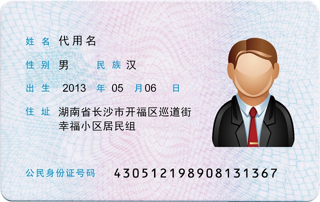
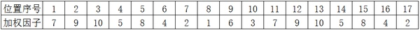
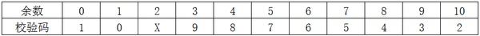

# 身份证号码编码规则及其应用

> 引言：身份证号码在产品设计中的应用比较多，如实名认证、绑定银行卡、金融资料录入等，本文将主要分享身份证号码编码规则及其在产品设计中的应用。

说明：本文除特别说明外，身份证号码专指18位公民身份号码

## 一、身份证号码结构

早期‘身份证号码’叫‘社会保障号’，为15位，1999年开始更名为公民身份证号码，即第二代身份证，为18位，且终身不变。

_430512_ _19890813_ _136_ _7_

公民身份号码是特征组合码，由前十七位数字本体码和最后一位数字校验码组成。排列顺序从左至右依次为六位数字地址码，八位数字出生日期码，三位数字顺序码和一位数字校验码。

**地址码：** 表示编码对象常住户口所在县(市、旗、区)的行政区划代码。对于新生儿，该地址码为户口登记地行政区划代码。需要没说明的是，随着行政区划的调整，同一个地方进行户口登记的可能存在地址码不一致的情况。行政区划代码按GB/T2260的规定执行。

**出生日期码：** 表示编码对象出生的年、月、日，年、月、日代码之间不用分隔符，格式为YYYYMMDD，如19880328。按GB/T 7408的规定执行。

**顺序码：** 表示在同一地址码所标识的区域范围内，对同年、同月、同日出生的人编定的顺序号，顺序码的奇数分配给男性，偶数分配给女性。

**校验码：** 根据本体码，通过采用ISO 7064:1983,MOD 11-2校验码系统计算出校验码。算法可参考下文。前面有提到数字校验码，我们知道校验码也有X的，实质上为罗马字符X，相当于10.

## 二、15位与18位身份证号码差异

出生日期码：15位身份证号码中出生日期码为4位，其中年份代码仅有2位，如590328，代表1959年生。

校验码：15位身份证号码中无校验位。

## 三、校验码算法

将本体码各位数字乘以对应加权因子并求和，除以11得到余数，根据余数通过校验码对照表查得校验码。

加权因子：

校验码：

算法举例：

本体码为：11010519491231002

- 第一步： 各位数与对应加权因子乘积求和`1*7+1*9+0*10+1*5+***=167`
- 第二步：对求和进行除11得余数`167%11=2`
- 第三步：根据余数2对照校验码得X

因此完整身份证号为：`11010519491231002X`

## 四、编码规则的应用

如上所述，身份证号码是基于一定的规则的，从身份证号码中可以挖掘以下信息：

1. 身份证长度验证：身份证长度仅存在15位或18位两种长度；
2. 身份证输入正确性验证：如身份证号为18位，可根据本体码与校验码得关系验证身份证号码输入有误，需要指出的是，验证通过并不代表身份证号码的真实性；
3. 获得户籍注册地信息：大部分情况下，该地即为出身地或籍贯。对应时需留意行政区划代码的更新迭代；
4. 出生年月及其正确性；
5. 性别：顺序码中奇数为男性，偶数位为女性；
6. 根据18位与15位身份证号码编码规则及校验码算法，将15位身份证号码转换为18位身份证号码；
7. 小心坑：因校验码为X，实际上有大小写输入不同，请注意兼容或统一。
