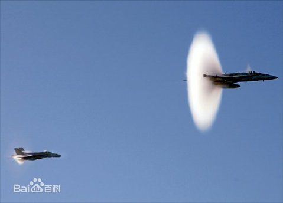

# 什么是音爆？

比喻的方式介绍：设想一下你正在周未的三里屯或者外滩，反正是人流密集的地方。远远地你看见一个老相识，想凑过去叙个旧，于是加快了脚步。随着你越走越快，就会发现路人对你的阻碍越来越大，直到你快到路人来不及躲避，此时人流对你来说已经变成了人墙。这时候你是多么想变身成为绿巨人啊，咚地一声把人墙撞飞，胳膊上挂着七八个人如若无物。 

 跟路人一样，空气中的分子“躲开”的速度是有限的，这个速度的极限就是音速。如果物体运动的速度超过了音速，它前方的空气再也无法被挤开，而是被压缩成为一堵“墙”，这堵墙就是音障，穿透这堵墙发出的声音就是音爆。

在1947年10月14日之前，人类所有想要突破音障的努力都以悲壮的失败告终，那些飞行家们要么无论如何也无法接近那个魔咒一样的速度，要么就是在音障上撞得粉身碎骨。前者的原因是飞机的某一部分——比如螺旋桨的桨叶尖端——早就突破了音速，这导致阻力的极大增加，让飞机没法再快一点。

1947年10月14日发生了什么事？那一天，在美国西部的莫哈维沙漠上空，一声晴天霹雳，年轻的飞行员耶格尔（Charlie E Yeager）驾驶贝尔X-1火箭动力试验机穿透了音障制造出的音爆。那架小飞机掀开了人类航空史上著名的X系列试验飞机的序幕，今年耶格尔老爷子仍然硬朗着，95岁的他还天天在社交软件上与粉丝打成一片。