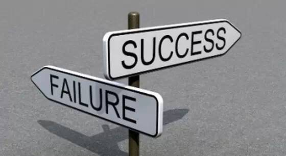

制度是绝情的，管理是无情的，执行是合情的：

1、管理是盯出来的，技能是练出来的，办法是想出来的，潜力是逼出来的。
2、没做好就是没做好，没有任何借口。随便找借口，成功没入口。
3、不是没办法，而是没有用心想办法。用心想办法，一定有办法，迟早而已。
4、结果不好，就是不好。
5、取是能力，舍是境界。
6、努力赞美别人，赞美别人=复制别人的优点。
7、细节做好叫精致，细节不好叫粗糙。
8、既民主又集中的战略战术实施，服从总是没有错。
9、先计划再行动，先策划再沟通。
10、多考虑应该做什么，少考虑能够做什么。

11、差异化是企业竞争力的核心，相对优势是最大的优势。
12、没有执行力，就没有竞争力。
13、选择重于努力，成败在于选择之间。过去的选择决定今天的生活，今天的选择决定以后的日子。
14、速度第一，完美第二；行动第一，想法第二；结果第一，过程第二。
15、执行力不讲如果，只讲结果。
16、不看错不错，只求好不好。
17、习惯于缺点是最大的缺点。
18、员工是笨蛋就要找到适合笨蛋的管理方法。
19、思想的高度决定行动的高度，文化的高度决定企业的高度。
20、没有想法，就没有结果。
21、行动不及时是因为痛苦达不到。
22、人人都喜欢的事不一定是对的，对的事不一定人人都喜欢。
23、不需要你看到别人没有用，要让别人看到你有用。
24、不要指望别人帮助你，要指望别人需要你。
25、沟通重在换位思考。
26、不满足让客户满意，要追求让客户感动，创造客户终身价值。
27、请示问题不要带着问题请示，要带着方案请示。汇报工作不要评论性地汇报，而要陈述性的汇报。
28、利益是执行的源动力，企业文化是执行的持续动力。
29、敢于负责任，才能担重任。
30、简单的才是有效的。

31、做好时间管理，做自己的主人。
32、宣贯的密度+力度=执行的深度+高度。
33、企业绝大多数人应该是精益求精的执行者。
34、理念变，天地变；理念不变，原地转。
35、凡成就大业者，喜欢把小事做细做透。
36、做企业：世界上原本有路，走的人多了也就没了路。
37、成功者常改变方法而不改变目标，失败者常改变目标而不改变方法。
38、凡事都有三种以上的解决方法。
39、若要如何，全凭自己。
40、多想一遍，少错一句话；多看一遍，少错一件事。

41、一错再错不是能力问题，而是态度问题。
42、每天三件事：必须做的事，应该做的事，可以做的事。
43、改变是痛苦的，不改变更痛苦。
44、员工往往出差错，是你的管理容易让他出差错。
45、以上一级的组织目标为方向：用科长的态度当科员，以部长的立场当科长，用老总的胸怀当部长，以老板的心态来打工。
46、象老板一样当干部，用老板的标准要求自己，象经营企业一样经营自己的岗位。
47、舒服的，往往就是退步的。
48、不谋全局者不足谋一域。
49、细节决定成败。