## MOZI是什么

MOZI是你的企业级应用信息化架构的基础设施，是政府/企业、应用、员工、用户/客户的连接器。
MOZI整合了身份治理、账号登录、权限管控、租户管理、组织管理、目录服务、API管理等基础而又必须的能力，能帮助应用快速实现产品化和商业化。
MOZI是由开发和运营过集团BUC&ACL原班人马精心打造，稳定可靠。

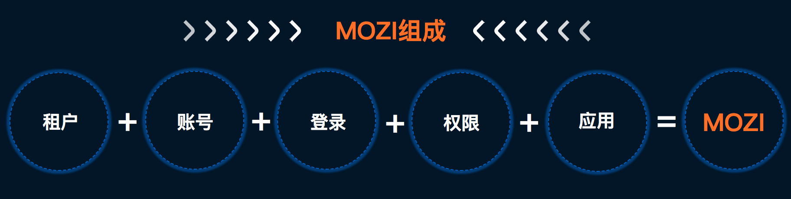

## MOZI产品能力

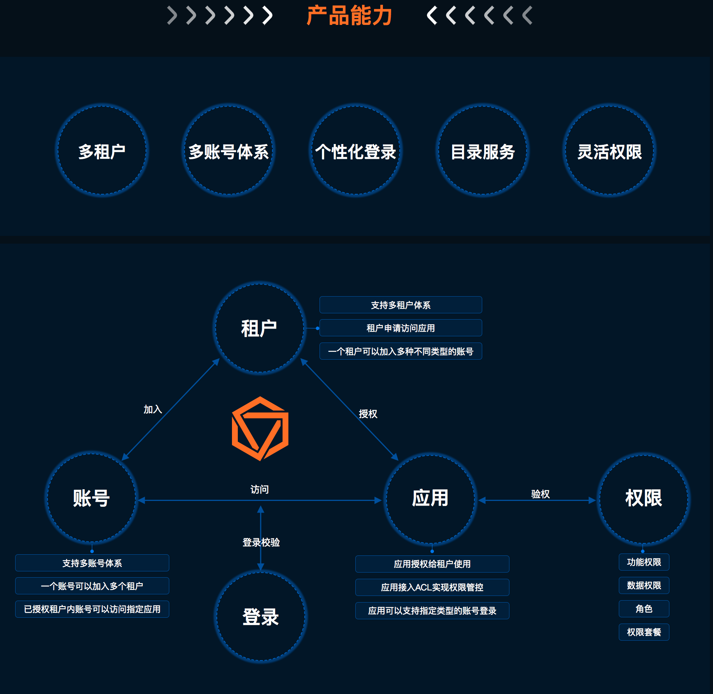

1.租户是一种组织形式，可以是企业，也可以是一个项目组，也可以是一家门店，你自由定义租户范畴；
2.同一个账号可以加入多个租户内，账号ID保持不变，账号必须加入租户才可以访问目标应用，我们支持你事先把账号添加到租户内，再来访问你的应用，也支持该账号首次登录你的应用成功后自动加入到指定租户内；
3.一个租户可以加入多种不同的账号体系，比如你的租户可以加入BUC小二做运营，也加入合作伙伴的淘宝账号来使用你的产品；
4.你可以自由定制自己的登录页面，保持和你的应用风格一致；
5.可以通过配置让你的应用支持多种登录方式，比如希望你的应用支持淘宝账号和BUC账号登录，只需要配置即可；

### MOZI账号产品能力

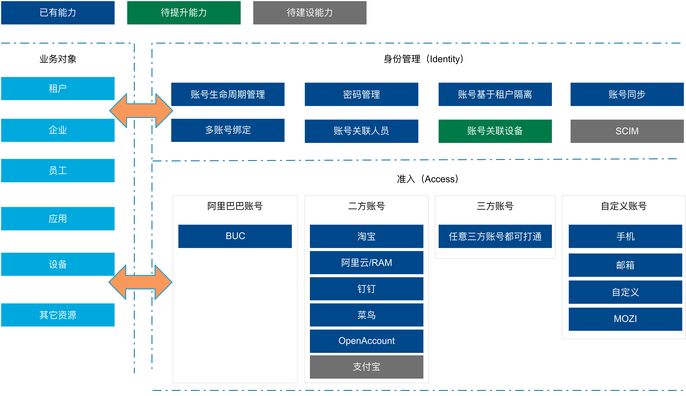

### MOZI登录产品能力

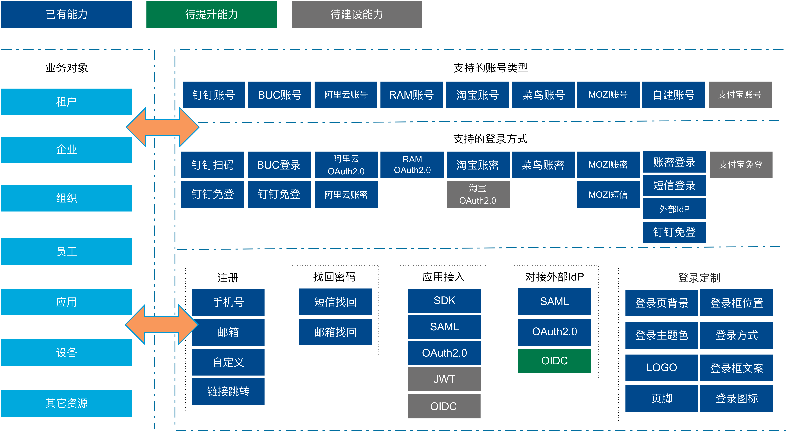

### MOZI权限产品能力

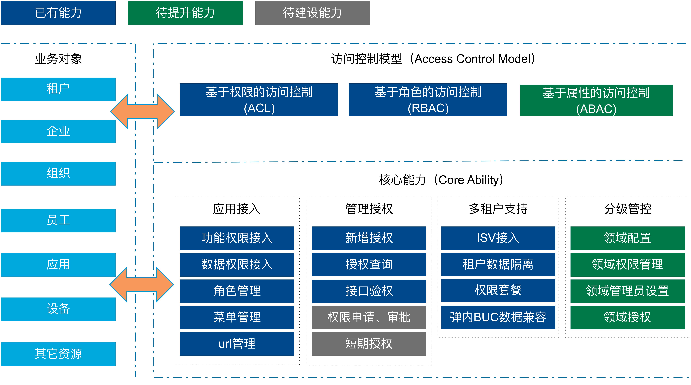

### MOZI租户和目录服务能力

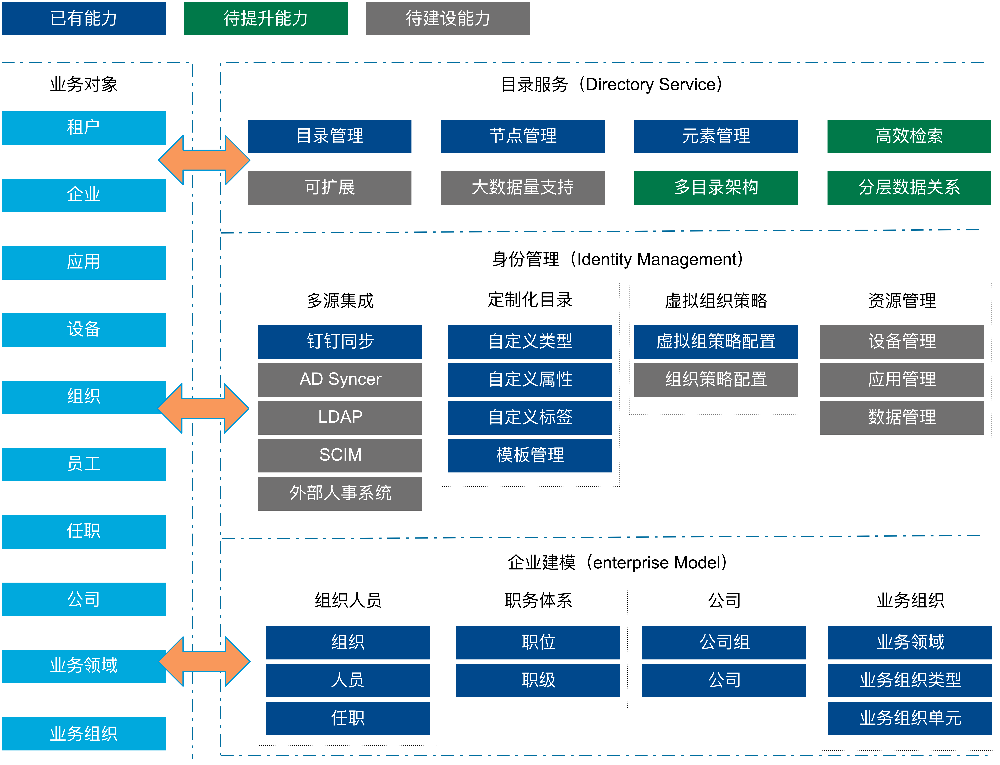

### 

### MOZI应用中心产品能力

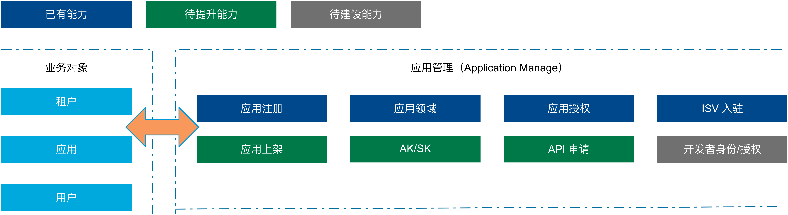

## MOZI发展历程

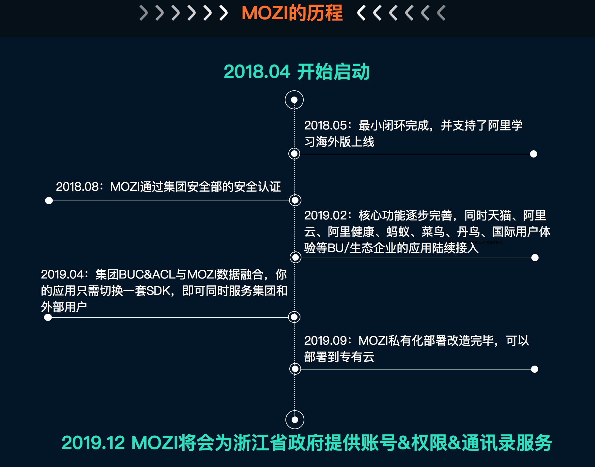

## MOZI当前已服务对象

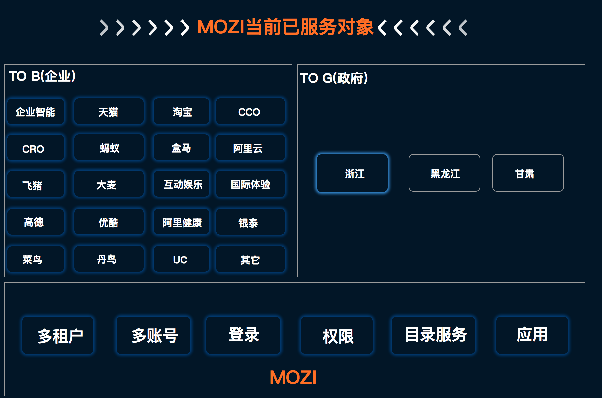

## MOZI典型应用场景

|   场景   |   说明   |
| :--- | :--- |
|   集团员工和生态员工基于不同账号体系协同办公 | 生态企业部分用户进了集团，但是还有一部分没有进入，MOZI可以支持进了集团的员工用BUC账号登录，然后没有进入集团的员工继续使用你原有账号体系登录。  |
|   集团员工和外部商家&合作伙伴基于不同账号体系使用同一个系统来协作 | 我的产品不仅要给阿里集团使用，也想提供给外部的人来使用，比如猎头，供应商，合作商等。他们没有BUC账号，但是他们有淘宝、钉钉等账号体系，MOZI可以支持各类常见的账号体系，支持不同账号加入不同租户。 |
| 直接使用MOZI来自建一套账号体系 | 我的产品不太适合用市面上的已有账号体系来使用，想自己构建一套，比如手机登录、邮箱登录或者自定义账户名的模式，MOZI也是完全支持的。 |
| 我的产品想去阿里云售卖 | MOZI是可以支持阿里云账号和RAM账号的，也可以支持阿里云上面的应用来调用我们的服务 |
| 我的客户全部是钉钉企业客户 | MOZI已经和钉钉深度集成，支持钉钉通讯录实时同步，扫码登录，免登等场面。 |
| 我想精确控制我的应用权限，让不同类型的组织&人员有不同的权限 | 比如我要服务大型的连锁门店，门店分为省市区县等复杂的结构，我想控制不同地区的不同门店的不同身份的人的权限，这个如何做，MOZI可以通过数据权限+授权范围来帮你实现。 |
| 我需要人员管理和组织架构管理 | MOZI可以支持组织架构无限扩展，人员属性自由扩展，我们还具备标签定义，用户组，多汇报线等能力。 |

## 应用对接MOZI能获得什么

| 价值 | 说明 |
| ----- | ---- |
| 降低成本 | 1.集团已有应用切换到MOZI只需要切换一套SDK。2. 新应用接入MOZI让你省去大量的时间去自建账号&权限体系，更加专注于自身业务 |
|  安全保障 | MOZI的整体安全能力经过异常严格的检查，具备了集团安全部认可的公网可见应用级安全能力和数据安全能力。 |
| 个性定制 | MOZI提供了个性化登录、权限组件样式的能力。应用和租户都可以基于扩展点来定制自己的个性样式。 |
| 业务拓展 | MOZI提供多租户&多账号的支持能力，让应用的目标用户从单一企业和账号拓展到其它多样化的企业和账号平台。|
| 数据价值 | 登录行为、鉴权行为、服务调用日志等数据经过数据清洗实现离线化数据存储，便于应对各种内审、合规等审计要求。|
| 稳定性 | MOZI团队经历数次双十一的大考，对稳定性&可用性非常有经验，让你没有后顾之忧。|
| 持续性 | MOZI团队会一直打磨这个产品，无论是体验还是功能，绝不会半途而废，跟随业务一起成长。现在MOZI开始为政府提供账号&权限&通讯录服务，无疑是对我们产品能力的一次重大提升的机会。 |

## MOZI部分功能展示

#### 租户管理员视角首页

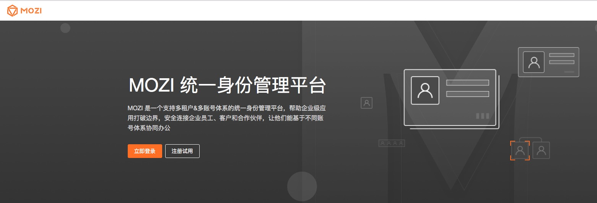

#### 租户管理员视角的主页面

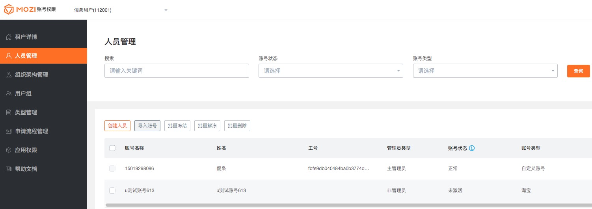

#### MOZI登录

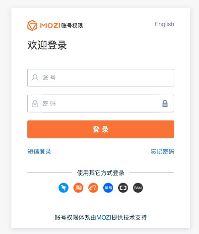

#### 登录后选择租户

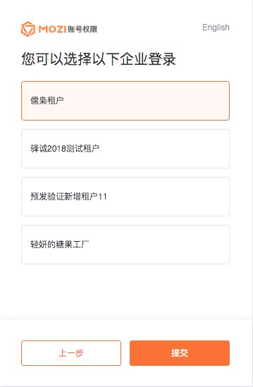

#### 自定义登录配置

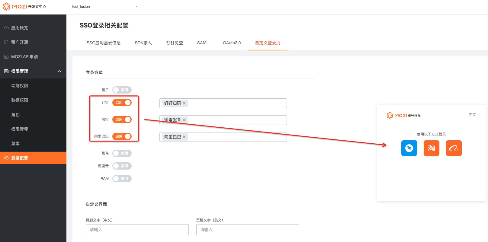

#### MOZI数据权限

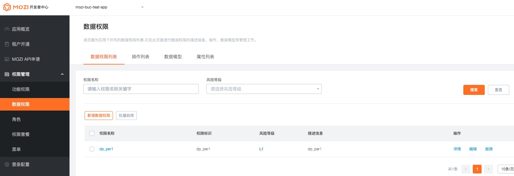

## 

## 