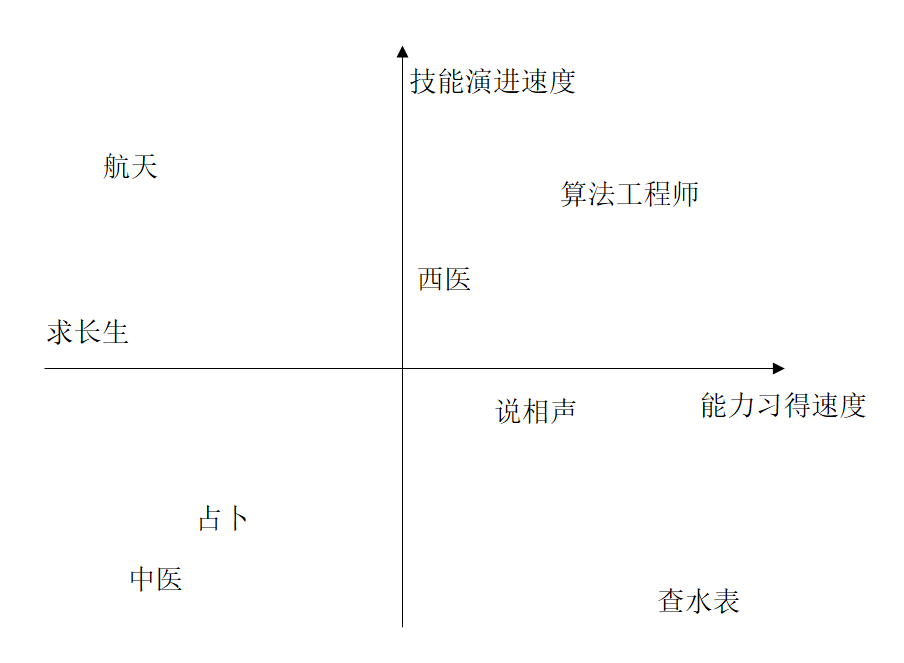
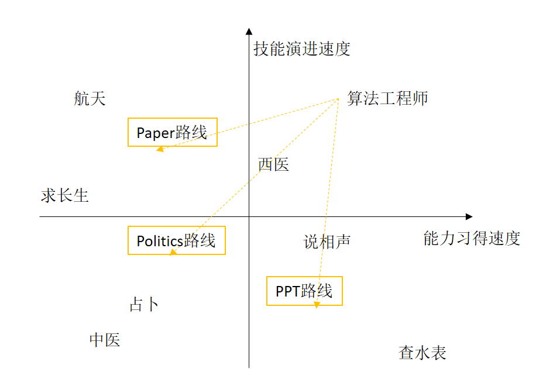
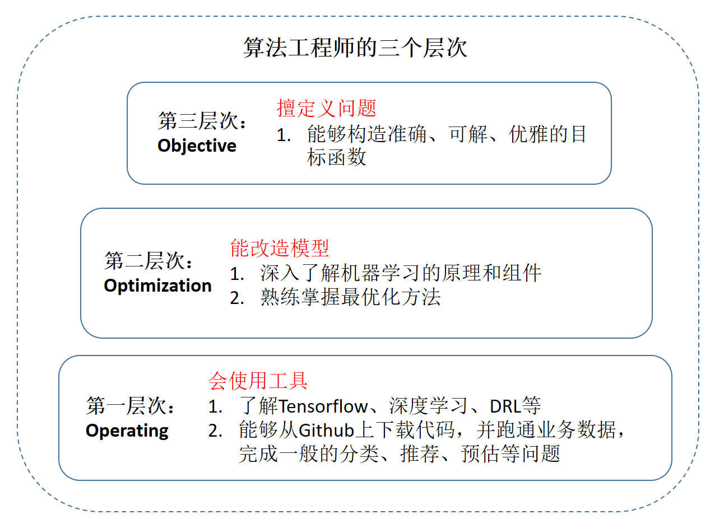
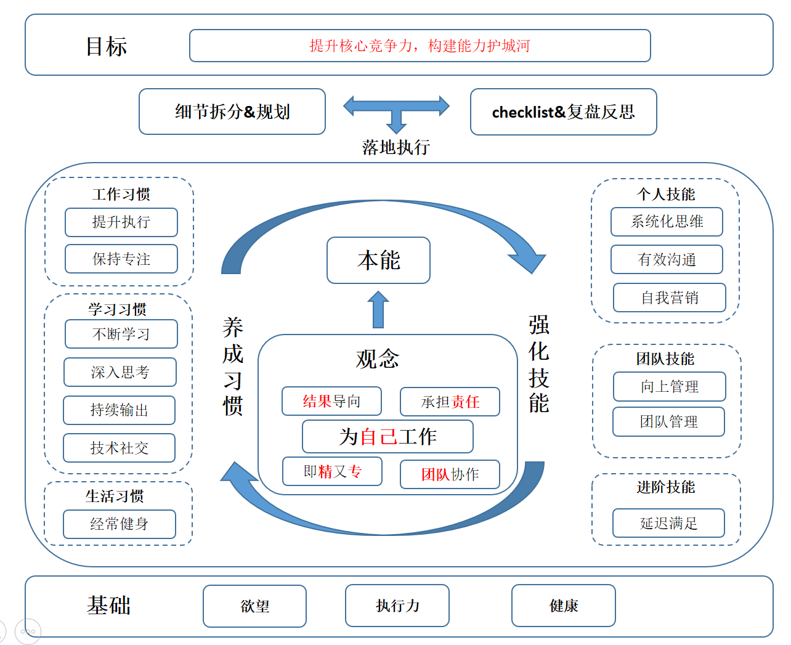
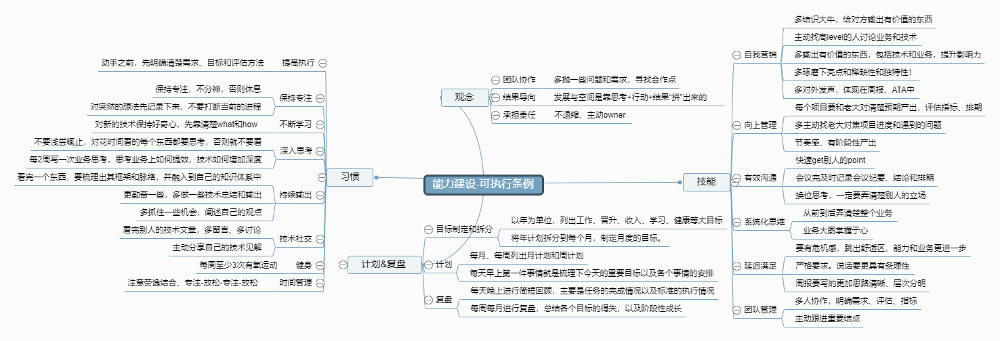
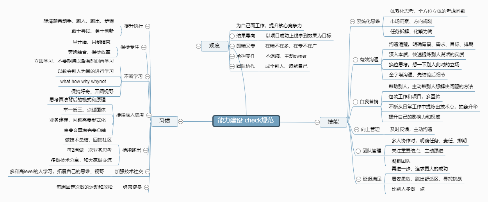

# 背景

近两年，中年危机的言论着实让算法工程师们十分焦虑。我对这个问题也有一些思考， 结合自身的特点并参考了别人的一些结论设计了应对的初步方案。趁着假期梳理了思路，把这篇文章分享出来，希望能给大家一些启发，并希望收到大家的意见一块来讨论。

# 问题分析和定义

要解决这个问题，需要从问题本身出发，分析为何会有中年危机，以及应该构建哪些能力来进行应对。
是否会遭遇中年危机，与职业本身特性有很大关系。来自于两点(这一节的内容主要参考了文献[[6\]](https://mp.weixin.qq.com/s/89_0_tRktH28D2aIGWfNtQ), [[7\]](https://mp.weixin.qq.com/s?__biz=MzIyOTAyOTEyNw==&mid=2649631849&idx=1&sn=dab89770d49a18106156ffb32c6c5a69&chksm=f0526801c725e117d76f0a05bfee7d40b76df9028921f78c044398dc3d9e46ab47103a41781f&scene=21#wechat_redirect))：
1. 能力习得速度快的行业，后辈更容易挑战前辈，形成中年危机。
2. 技能演进速度快的行业，手里的秘籍容易成为废纸，形成中年危机，如下图所示。

 图1.技能演进速度快的行业

因此，就这两个特点，对一些行业进行定性分析，放在下图之中，供大家参考。

图2.常见职业在能力习得和演变象限中的分布

在这张图根据技能演进速度和能力习得速度分为四个象限。左下角为技能演进速度慢和能力习得速度慢的行业，比如中医。右上角为技能演进速度快和能力习得速度快的行业，比如算法工程师。算法工程师虽然身处高科技行业，但得益于大量的开源技术和丰富的培训，比如"0基础上手机器学习", "2周培训助你成为深度学习专家"，使得编程已经变为很容易上手的。从而导致行业的门槛容易跨越，能力的习得速度也变得很快。而从技术演进速度，确实没有哪个行业能与之匹敌。

应该怎么做呢？

还是要在上面的图中按图索骥，找到让两个速度慢下来的出路。无论怎么腾挪，都要从狭义的算法工程师职业转换到宏观的算法工程师职业，给出几条可行路线，概括为3P（PPT、Politics、Paper）。

图3.3P路线

其中，
1. Paper路线。
简单来说，能够跟学术界搭上点儿关系，在工业界的title就是技术专家。具体的形式包括栖身学术圈在顶级会议上发论文并与大佬们谈笑风生、或者在技术决策上具有团队影响力和话语权的架构师等。这条路线相对来说门槛高一些，需要的扎实的专业技能和灵活的业务建模能力，年龄和经验往往是优势。虽然学术新技术也层出不穷，但如果习得核心技能，中年危机来得并不猛烈。
2. Politics路线：
这条路线，是从生产力岗位转入生产关系岗位，从面向系统到面向人，一般来说就是各种管理岗。这条路性价比高，竞争也激烈，要有意识地构建好自己的能力，才有机会进入。
3. PPT路线：
这条路线，是从写代码的岗位转入写PPT的岗位，比如产品、运营等。

适合于走哪个路线，需要结合自己的性格来定。

工程师都有一个共同的性格特点，追求简单，追求完美，思维方式上比较理性和逻辑性，看问题比较趋向于非黑即白。对这类性格人来说，走技术专家是一条捷径。其面对的是复杂的系统和业务问题，如果能静下心来仔细钻研技术，一定能在某个方面做得比别人好。这个路线对工程师性格的人来说，其实就是在解决简单的复杂问题。

而怎么才能算得上技术专家呢？算法工程师的演进分为三个层次：

图4. 算法工程师能力演进的三个层次

在机器学习领域，算法工程师脚下的进阶之路是清晰的：当你掌握了工具、会改造模型，进而可以驾驭新问题的建模，就能成长为最优秀的人才，达到技术专家的水平，中年危机也就离你越来越远

因此，如何做到技术专家的需要具备什么样的能力呢，其能力模型应该是怎么样的呢？下面我们要构建一个形而上的能力框架，培养能力背后的能力。

# 整体思考：

整体的能力模型如下图所示。

图5. 算法工程师能力模型

处于中心的是行为处事的准则，也就是正确的思想观念。
其中最核心的观念就是要把职业生涯当作自己的事业，为自己而工作，把提升自身能力作为事业的目标。
围绕着这一核心的还包括以结果导向、主动承担责任、技术既精又专，增强团队协作等。

这些都是大家都明白的道理，但是为何事情还是做不好呢？最主要的原因只是明白道理的意思，而并没有将这些道理融入到自己的潜意识里面。在做决策时，也就不能够按照这些道理来处事。

因此，首先需要树立正确的观念，并能够将其转化为潜意识，作为本能的一部分。在行动的时候，通过潜意识来指导为人处事的行为准则，就可以保证做正确的事，并且正确的做事。
为了能够达到这个效果，需要合理的习惯和技能来保证。习惯和技能相辅相成，影响着平时的一言一行，通过规范言行来帮助将这些观念深入本能。

而为了保证上述的方案能够落地执行，需要执行详细的规划并反复实践，并通过复盘等手段总结得失，查缺补漏。

大厦需要有坚实的基础，否则只是能空中楼阁。渴望成功的欲望、优秀的执行力和健康的身体便是这一切的基础。

# 能力模型分解和培养

## 树立正确的观念并转化成本能

为自己工作。
首先，工作不是为老板工作，而是为自己工作。工作是属于公司的，而职业生涯却是属于你自己的。当把这件事情想明白的时候，你的职业发展将会焕发新的青春。在这个过程中，学习如何像企业一样思考，如何提升自己的技能，让公司持续的购买你的服务。

结果导向。
公司付钱的目的是要带来价值，你提供的服务最终要能产出结果。公司里面功劳大于苦劳，结果大于过程。正所谓是为过程喝彩为结果付酬。

承担责任。
责任与重要性呈正比。当你的责任越大，承担的事情越多，公司对你的依赖也就越重，也更能够让你脱颖而出，得到更好的资源和机会。所以，需要主动的承担更多的责任，不要退缩，敢于顶上去。而且勇于承担责任，做出引人注目的成绩，成为问题的解决者，并不断更新自己，也更容易获得晋升。

即专又精。
要揽瓷器活，得有金刚钻。做事情做深入专一，这样提供的服务才能够足够的优秀，才值得别人pay for money。切忌什么都会，但什么又不懂。

团队协作。
要相信团队的能量是无穷的，创建一个好的环境，合理的激励措施，好的成长路线。每个人都能激发并释放自己的能量，让优秀的人脱颖而出。

## 养成良好习惯，提升执行效率

在习惯这方面，大概可以分为3部分：

1. 第一部分是工作习惯，包括提升执行、保持专注。
2. 第二部分是学习习惯，包括不断学习、深入思考、持续输出、技术社交。
3. 第三部分是生活习惯，包括经常健身等。

工作习惯。
目标就是提升生产力。在这块有无论是方法论还是工具系统都有很多的资料，在这里不再累述。

学习习惯。
开篇就提到了，算法工程师的技术演变速度很快，所以在这个行业不断学习。学习的重要性大家都知道，而且学习的方法都大家都各有一套，毕竟都是一路考过来的。但在繁忙的工作中以及飞速发展的技术中，应该学什么以及怎么学还是非常值得研究的。
上面提到的学习的四个习惯，是相辅相成的。
首先得先有持续学习的主动性，并且不能浮于表面，需要深入本质，思考背后的模式和原理，并举一反三，融会贯通。持续输出是保证深入思考的重要措施，也能够积累自己的技术体系。最后，搞技术不能闭门造车，技术这玩意也需要社交，得接受吸收码神们的指导。

这里主要提2点：
1. 第一点是学习方式，记住， 教会他人永远是最高效的学习方式！这个正是费曼学习法的精髓所在。
2. 第二点是持续思考。现在层出不穷的技术，比如RNN、LSTM、attention、transformer再到bert，如果只学算法本身，是永远慢人一步的。而如果深入思考背后的原理，则很容易融会贯通。一旦了解得比别人深，就容易看到问题本质，产生信心，激发乐趣。这时候你的解决方案就比别人漂亮，逐渐建立起了影响力，成为了“专家”。因此公司里的疑难杂症会主动找上门来。你就比别人得到了更多的解决问题的机会，从而更快地提升能力。一旦进入良性循环，你的进步就比别人快，但付出的却不一定比别人多。这时候你已经走上了捷径。

生活习惯。
这点不就说了，早睡早起，经常锻炼。

## 强化技能，提升生产效率

在能力建设这块，也是一个体系。分为3个层面：
1. 个人能力，包括系统化思维全面分析问题，拆解问题，逐步分解和执行，并能够有效沟通协调上下游资源把事情做成，拿到结果。事情做完了，需要包装，进行自我营销。
2. 当个人的贡献有了，负责的范围越来越多，承担的责任越来越大，这个时候得向上管理，和老板把事情讲清楚，获得老板在资源和人力的上的支持。当队伍壮大了，就需要做出应有的贡献，所以团队管理，提升组织效能就变得重要了。
3. 做完这些后，就会感觉小有成就，马上就踏入人生巅峰了。但这个时候需要停止当前成功的喜悦，延迟满足，对自己提出更高的要求，来获得更大的成功。

这里只说下延迟满足。
提到延迟满足，大家首先想到的可能是著名的“棉花糖”实验。但是这里所说的延迟满足，指的是延迟个人在成功上的满足感，不要止步于当前的成功，多给自己加一些挑战。比如这个项目已经拿到了+5%，那还能不能再提升到+8%，或者解决方案能不能更优美一些，约束能不能少一些。这样不断给自己拔高目标，就能让自己获得更大的成功。

## 落地执行，保证方案完美执行

好的方案需要有完善的机制来保证其落地执行。在具体执行的时候，需要：
首先，对培养的习惯和完善的技能拆分下来，并制定可行的条例。比如下方的图：

图6. 能力建设-可执行条例

然后，制定check规范并定期复盘和总结，查缺补漏，看自己是否达到预期的目标。

下面就是典型的check规范，对每个都有具体可落地可执行的标准和准则，在做总结的时候，逐条进行检查，看自己有没有做到。

图7. 能力建设-check规范

## 大厦之基-欲望、执行力、健康

完成上面的方法，需要3个根基： 成功的欲望、高效的执行、健康的身体。
欲望是人类进步的阶梯，在做事情之前，需要渴望成功，才可能成功。佛系的人，随遇而安，得过且过，也是比较难取得超乎常人的成绩的。
高效的执行力保证想法能够被很好的实现，只说不做，做的不够好，做的不够高效，一样都不能够完美的得到结果。
身体就是所有的一切，所以，程序员们，为了自己，为了公司，为了国家都应该运动起来。

# 总结

不要随心所欲地生活，也不要随遇而安地行走在职业生涯的漫漫长路上。没有明确的方向，你走的每一步都是徒劳的。
对算法工程师来说，没有以不变应万变的方法，唯一不变的就是改变，树立长远的目标，持之以恒，踏实前行，方能达到最终的目标。

