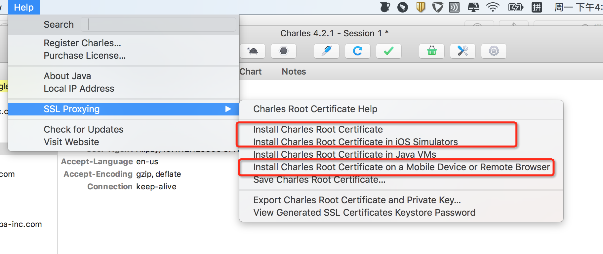
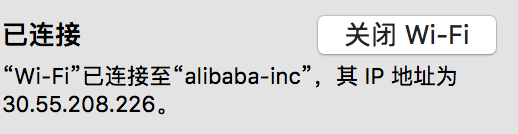
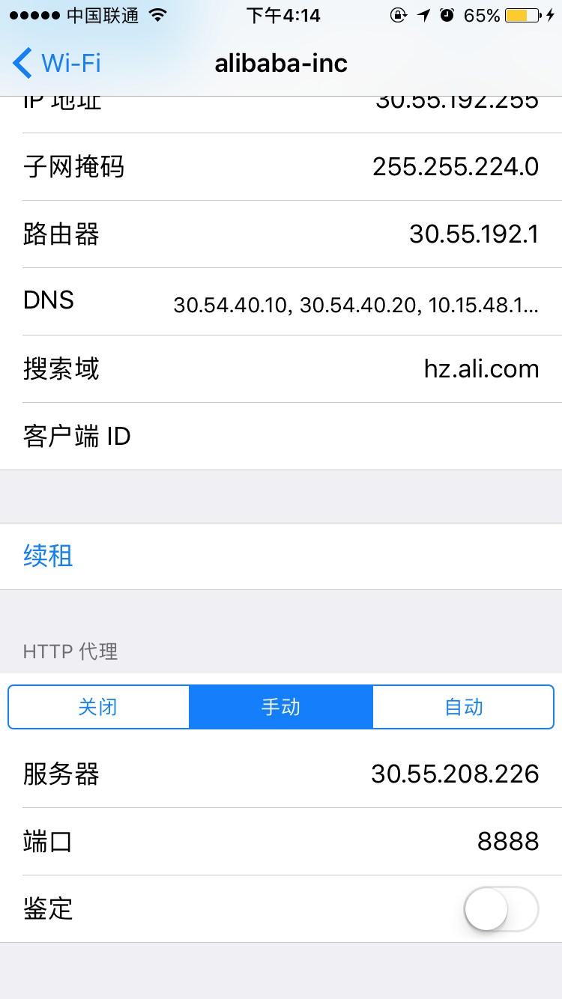
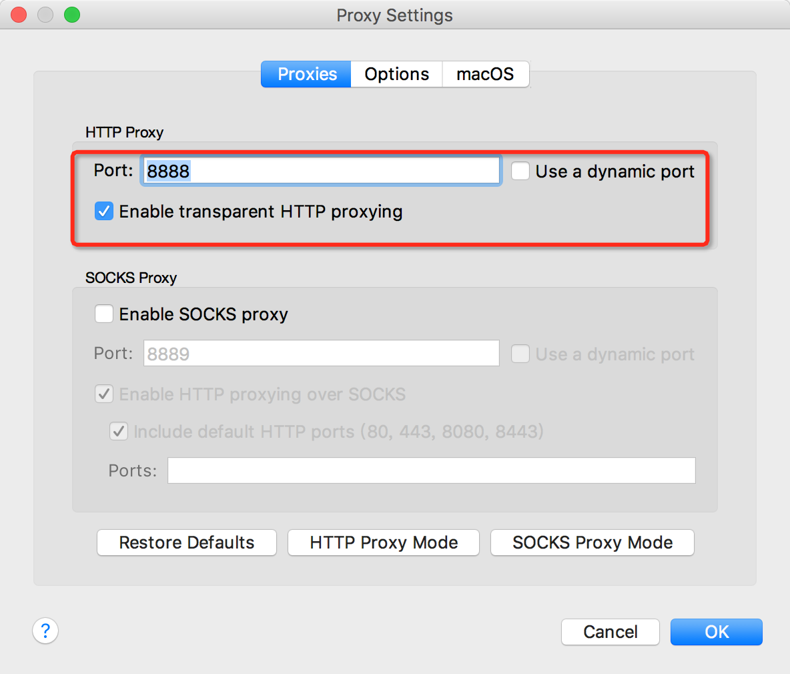
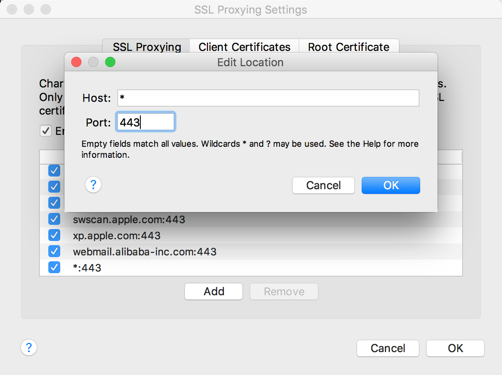
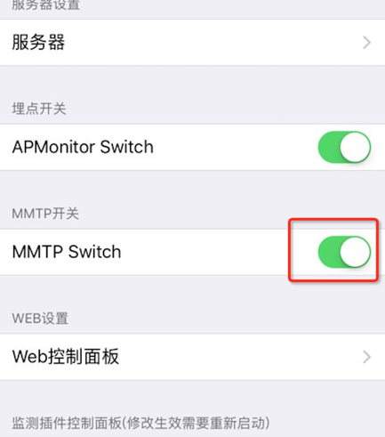
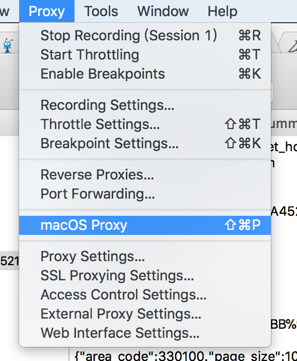

+++
title = "Charles代理"
template = "page.html"
date = "2019-08-21"
updated = "2020-05-05"
+++

##  使用背景

怎样查看完整的小程序请求信息，快速排查和定位问题？
目前的现状，IDE 中虽然有 network 面板，但是使用了代理，所以看到的 request、response、headers 等信息都做了处理，无法追踪到更多的信息。
解决方案，通过模拟器或者真机中模拟请求，借助 Charles 抓包工具，可以详细看到小程序请求的核心信息。注意，Charles 是收费软件，试用版本每隔半小时需要 restart，启动存在延时，最好在阿里郎上申请正式版本使用，方便后续调试。

## 详细设置步骤

### 安装 Charles 证书

charles 在抓取 https 请求时，可能会出现乱码现象，导致有些 https 页面打不开，所以需要安装三个证书，详细如下图所示。

- 证书一：安装 Charles 的信任证书
- 证书二：模拟器的信任证书
- 证书三：手机和远程连接的信任证书

### 手机抓包配置

#### 第一步：添加手机的 HTTP 代理

1、查看 PC 的 IP 地址

2、设置手机 HTTP 代理

#### 设置 Charles 代理

1、Proxy-Proxy Setting

2、Proxy->SSL Proxying Setting->add 一个代理

#### 手机证书安装

- 使用手机浏览器打开 chls.pro/ssl，会跳转到证书安装，完成手机证书安装。
  注：需要使用手机自带浏览器：IOS 手机是 Safari，安卓手机也有自带的浏览器

#### 关闭支付宝安全代理

- 使用支付宝扫描链接：<https://ds.alipay.com/fd-ipddfamm/index.html>，点击“关闭安全代理“按钮，关闭安全代理。

## RPC 抓包调试

由于 RPC 使用的是自己定义的 spdy 协议，charles 无法抓包，但是可以在开发及测试环境关闭 mmtp 开关将 spdy 进行降级为 http 协议。具体操作如下：

- 从伙伴下载开发包：具体可以参考环境配置的文档，下载可切环境的钱包。
- 安卓手机配置：支付宝设置里面 “网络链路配置” 不要勾选 “是否使用新链路” 和 “是否使用 spdy 链路”
- IOS 手机配置：支付宝设置进入设置关闭 mmtp 开关

- 此时，rpc 接口已是 https 接口，可以使用 charles 进行抓包调试。

## Charles 抓包问题汇总

### **怎样关闭 Mac 端包的抓取**

将 maxOS Proxy 取消选中。

### 接口乱码问题

场景：安装完手机证书后，当时接口没有乱码，等过段时间使用，重又乱码
解决办法：手机 ->设置 ->通用 ->关于本机 ->证书信任设置 ->将 Charles 对应的证书的 switch 开启

### IOS11 系统无法抓包

解决方案：参照问题二的解决方式。
