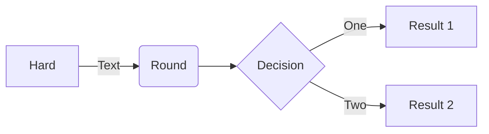
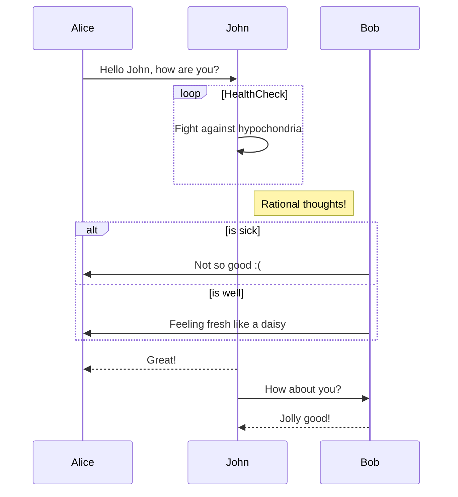
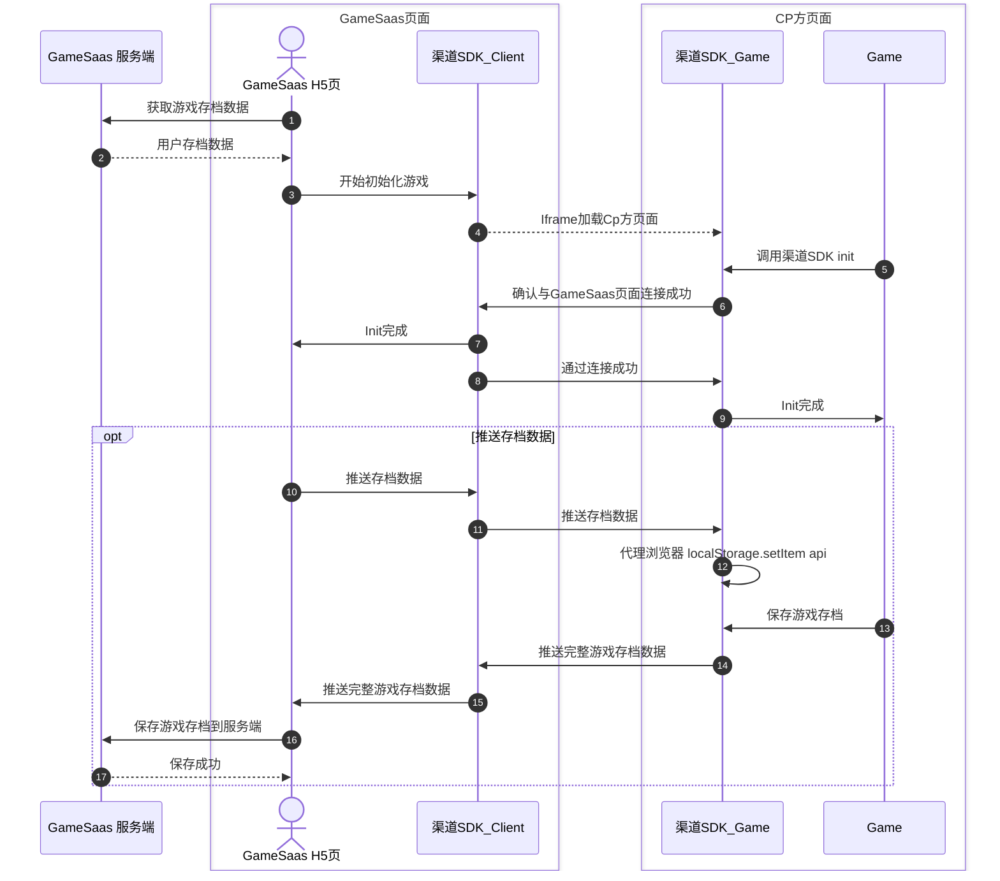
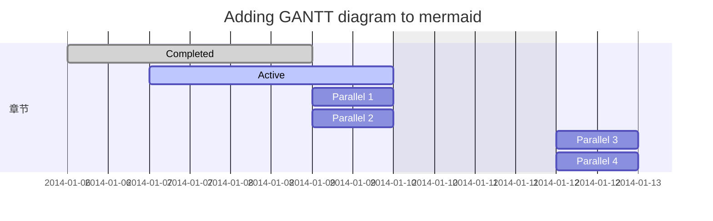
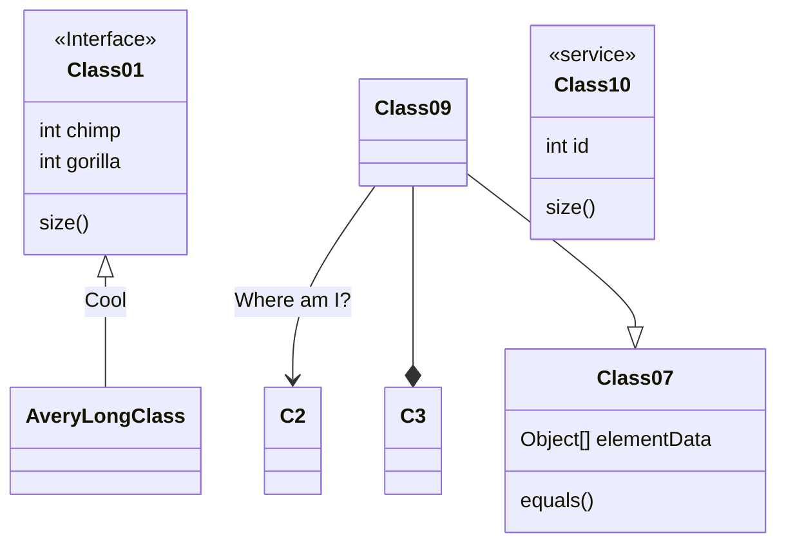
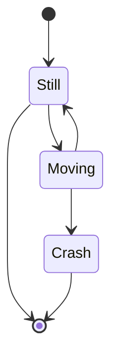
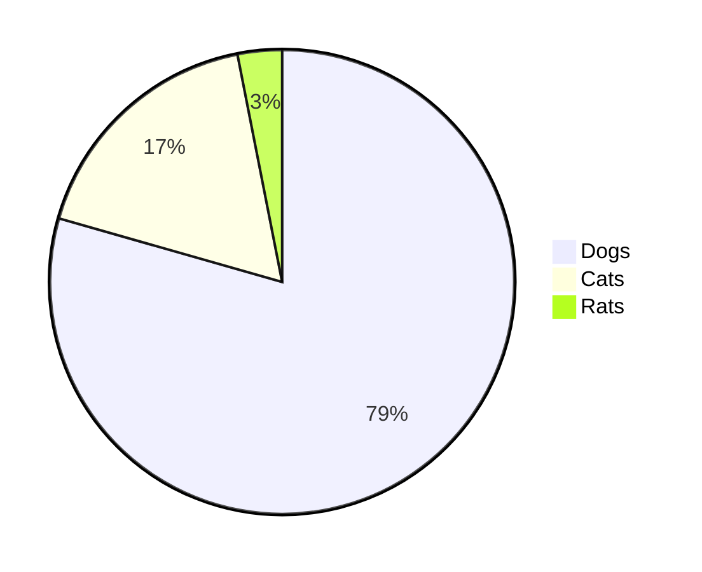
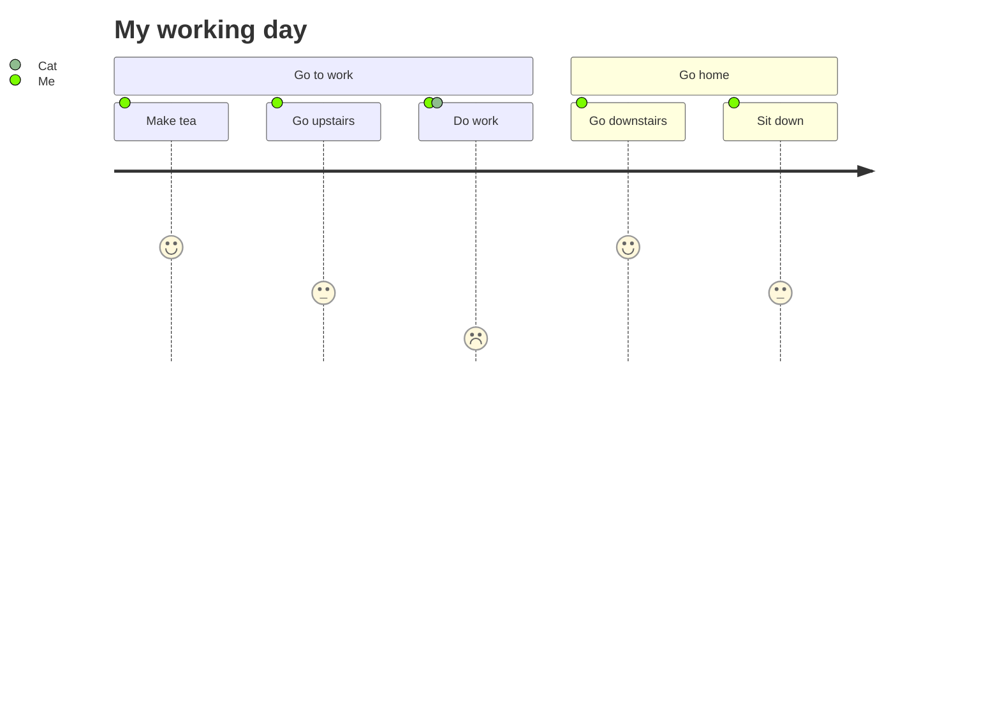
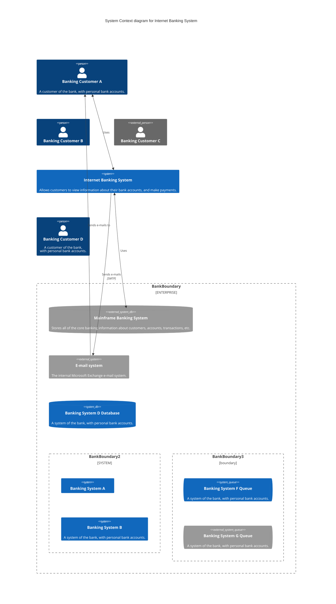

<p align="center">

</p>
<h1 align="center">Mermaid <a href="https://www.npmjs.com/package/mermaid"></a></h1>
<p align="center">通过解析类 Markdown 的文本语法来实现图表的创建和动态修改。<p>

:trophy: **Mermaid 被提名并获得了 [JS Open Source Awards (2019)](https://osawards.com/javascript/2019) 的 "The most exciting use of technology" 奖项!!!**

## 关于 Mermaid

Mermaid 是一个基于 Javascript 的图表绘制工具，通过解析类 Markdown 的文本语法来实现图表的创建和动态修改。Mermaid 诞生的主要目的是让文档的更新能够及时跟上开发进度。

> Doc-Rot 是 Mermaid 致力于解决的一个难题。

绘图和编写文档花费了开发者宝贵的开发时间，而且随着业务的变更，它很快就会过期。 但是如果缺少了图表或文档，对于生产力和团队新人的业务学习都会产生巨大的阻碍。 <br/>
Mermaid 通过允许用户创建便于修改的图表来解决这一难题，它也可以作为生产脚本（或其他代码）的一部分。<br/>
<br/>
Mermaid 甚至能让非程序员也能通过 [Mermaid Live Editor](https://mermaid.live/) 轻松创建详细的图表。<br/>
你可以访问 [教程](https://mermaid.js.org/ecosystem/tutorials.html) 来查看 Live Editor 的视频教程，也可以查看 [Mermaid 的集成和使用](https://mermaid.js.org/ecosystem/integrations-community.html) 这个清单来检查你的文档工具是否已经集成了 Mermaid 支持。

如果想要查看关于 Mermaid 更详细的介绍及基础使用方式，可以查看 [入门指引](https://mermaid.js.org/intro/getting-started.html), [用法](https://mermaid.js.org/config/usage.html) 和 [教程](https://mermaid.js.org/ecosystem/tutorials.html).

## 示例

**下面是一些可以使用 Mermaid 创建的图表示例。点击 [语法](https://mermaid.js.org/intro/syntax-reference.html) 查看详情。**

<table>
<!-- <Flowchart> -->

### 流程图 [<a href="https://mermaid.js.org/syntax/flowchart.html">文档</a> - <a href="https://mermaid.live/edit#base64:eyJjb2RlIjoiZ3JhcGggVERcbiAgICBBW0hhcmRdIC0tPnxUZXh0fCBCKFJvdW5kKVxuICAgIEIgLS0-IEN7RGVjaXNpb259XG4gICAgQyAtLT58T25lfCBEW1Jlc3VsdCAxXVxuICAgIEMgLS0-fFR3b3wgRVtSZXN1bHQgMl0iLCJtZXJtYWlkIjp7InRoZW1lIjoiZGVmYXVsdCJ9fQ">live editor</a>]




### 时序图 [<a href="https://mermaid.js.org/syntax/sequenceDiagram.html">文档</a> - <a href="https://mermaid.live/edit#base64:eyJjb2RlIjoic2VxdWVuY2VEaWFncmFtXG5BbGljZS0-PkpvaG46IEhlbGxvIEpvaG4sIGhvdyBhcmUgeW91P1xubG9vcCBIZWFsdGhjaGVja1xuICAgIEpvaG4tPj5Kb2huOiBGaWdodCBhZ2FpbnN0IGh5cG9jaG9uZHJpYVxuZW5kXG5Ob3RlIHJpZ2h0IG9mIEpvaG46IFJhdGlvbmFsIHRob3VnaHRzIVxuSm9obi0tPj5BbGljZTogR3JlYXQhXG5Kb2huLT4-Qm9iOiBIb3cgYWJvdXQgeW91P1xuQm9iLS0-PkpvaG46IEpvbGx5IGdvb2QhIiwibWVybWFpZCI6eyJ0aGVtZSI6ImRlZmF1bHQifX0">live editor</a>]



ddd





### 甘特图 [<a href="https://mermaid.js.org/syntax/gantt.html">文档</a> - <a href="https://mermaid.live/edit#base64:eyJjb2RlIjoiZ2FudHRcbnNlY3Rpb24gU2VjdGlvblxuQ29tcGxldGVkIDpkb25lLCAgICBkZXMxLCAyMDE0LTAxLTA2LDIwMTQtMDEtMDhcbkFjdGl2ZSAgICAgICAgOmFjdGl2ZSwgIGRlczIsIDIwMTQtMDEtMDcsIDNkXG5QYXJhbGxlbCAxICAgOiAgICAgICAgIGRlczMsIGFmdGVyIGRlczEsIDFkXG5QYXJhbGxlbCAyICAgOiAgICAgICAgIGRlczQsIGFmdGVyIGRlczEsIDFkXG5QYXJhbGxlbCAzICAgOiAgICAgICAgIGRlczUsIGFmdGVyIGRlczMsIDFkXG5QYXJhbGxlbCA0ICAgOiAgICAgICAgIGRlczYsIGFmdGVyIGRlczQsIDFkIiwibWVybWFpZCI6eyJ0aGVtZSI6ImRlZmF1bHQifX0">live editor</a>]



### 类图 [<a href="https://mermaid.js.org/syntax/classDiagram.html">文档</a> - <a href="https://mermaid.live/edit#base64:eyJjb2RlIjoiY2xhc3NEaWFncmFtXG5DbGFzczAxIDx8LS0gQXZlcnlMb25nQ2xhc3MgOiBDb29sXG48PGludGVyZmFjZT4-IENsYXNzMDFcbkNsYXNzMDkgLS0-IEMyIDogV2hlcmUgYW0gaT9cbkNsYXNzMDkgLS0qIEMzXG5DbGFzczA5IC0tfD4gQ2xhc3MwN1xuQ2xhc3MwNyA6IGVxdWFscygpXG5DbGFzczA3IDogT2JqZWN0W10gZWxlbWVudERhdGFcbkNsYXNzMDEgOiBzaXplKClcbkNsYXNzMDEgOiBpbnQgY2hpbXBcbkNsYXNzMDEgOiBpbnQgZ29yaWxsYVxuY2xhc3MgQ2xhc3MxMCB7XG4gID4-c2VydmljZT4-XG4gIGludCBpZFxuICBzaXplKClcbn0iLCJtZXJtYWlkIjp7InRoZW1lIjoiZGVmYXVsdCJ9fQ">live editor</a>]

```
classDiagram
Class01 <|-- AveryLongClass : Cool
<<Interface>> Class01
Class09 --> C2 : Where am I?
Class09 --* C3
Class09 --|> Class07
Class07 : equals()
Class07 : Object[] elementData
Class01 : size()
Class01 : int chimp
Class01 : int gorilla
class Class10 {
  <<service>>
  int id
  size()
}
```



### 状态图 [<a href="https://mermaid.js.org/syntax/stateDiagram.html">docs</a> - <a href="https://mermaid.live/edit#pako:eNpdkLsOwjAMRX-l8ojahTEDCzB26kgYrMYtkfJAqVMJVf13QiIKqqfr44d8vUDvFYGAiZHponEMaJv5KF2V4na4V01zqjrWxhSUZYapuEetn7UbCy16P_5HzwGnR6FZfpdCDZaCRa3SWcunQQI_yJIEkaSiAaNhCdKtqRUj--7lehAcItUQn-pnBMSAZtroVWn2YYOU07b4z29Y37gJVYk">live editor</a>]

```
stateDiagram-v2
[*] --> Still
Still --> [*]
Still --> Moving
Moving --> Still
Moving --> Crash
Crash --> [*]
```



### 饼图 [<a href="https://mermaid.js.org/syntax/pie.html">文档</a> - <a href="https://mermaid.live/edit#base64:eyJjb2RlIjoicGllXG5cIkRvZ3NcIiA6IDQyLjk2XG5cIkNhdHNcIiA6IDUwLjA1XG5cIlJhdHNcIiA6IDEwLjAxIiwibWVybWFpZCI6eyJ0aGVtZSI6ImRlZmF1bHQifX0">live editor</a>]



### Git 图 [实验特性 - <a href="https://mermaid.live/edit#base64:eyJjb2RlIjoiZ2l0R3JhcGg6XG5vcHRpb25zXG57XG4gICAgXCJub2RlU3BhY2luZ1wiOiAxNTAsXG4gICAgXCJub2RlUmFkaXVzXCI6IDEwXG59XG5lbmRcbmNvbW1pdFxuYnJhbmNoIG5ld2JyYW5jaFxuY2hlY2tvdXQgbmV3YnJhbmNoXG5jb21taXRcbmNvbW1pdFxuY2hlY2tvdXQgbWFzdGVyXG5jb21taXRcbmNvbW1pdFxubWVyZ2UgbmV3YnJhbmNoXG4iLCJtZXJtYWlkIjp7InRoZW1lIjoiZGVmYXVsdCJ9fQ">live editor</a>]

### 用户体验旅程图 [<a href="https://mermaid.js.org/syntax/userJourney.html">文档</a> - <a href="https://mermaid.live/edit#pako:eNpljzEPgkAMhf9K05nFGJdbJXFiYmVpuKIncDVHL4QQ_ruHaILaqXnf63vpjLVYRoMAd4nB81R5SKNOO4ZiglFC6_wVLL3JwLU68XARUHnhTQcoqGVQJgMnAwV_5GSMj0HJhcHAcU_y7d7AYVUzOJP-ddyk3ydZGf0n66uldPqCPxWYYc-hJ2fTj_OqVqg3Tplo0mq5odhphZVfkpWiSjn5Go2GyBnGhyXl3NE1UI-moW7g5QkSoF5m">live editor</a>]

```
  journey
    title My working day
    section Go to work
      Make tea: 5: Me
      Go upstairs: 3: Me
      Do work: 1: Me, Cat
    section Go home
      Go downstairs: 5: Me
      Sit down: 3: Me
```



### C4 图 [<a href="https://mermaid.js.org/syntax/c4.html">文档</a>]

```
C4Context
title System Context diagram for Internet Banking System

Person(customerA, "Banking Customer A", "A customer of the bank, with personal bank accounts.")
Person(customerB, "Banking Customer B")
Person_Ext(customerC, "Banking Customer C")
System(SystemAA, "Internet Banking System", "Allows customers to view information about their bank accounts, and make payments.")

Person(customerD, "Banking Customer D", "A customer of the bank, <br/> with personal bank accounts.")

Enterprise_Boundary(b1, "BankBoundary") {

  SystemDb_Ext(SystemE, "Mainframe Banking System", "Stores all of the core banking information about customers, accounts, transactions, etc.")

  System_Boundary(b2, "BankBoundary2") {
    System(SystemA, "Banking System A")
    System(SystemB, "Banking System B", "A system of the bank, with personal bank accounts.")
  }

  System_Ext(SystemC, "E-mail system", "The internal Microsoft Exchange e-mail system.")
  SystemDb(SystemD, "Banking System D Database", "A system of the bank, with personal bank accounts.")

  Boundary(b3, "BankBoundary3", "boundary") {
    SystemQueue(SystemF, "Banking System F Queue", "A system of the bank, with personal bank accounts.")
    SystemQueue_Ext(SystemG, "Banking System G Queue", "A system of the bank, with personal bank accounts.")
  }
}

BiRel(customerA, SystemAA, "Uses")
BiRel(SystemAA, SystemE, "Uses")
Rel(SystemAA, SystemC, "Sends e-mails", "SMTP")
Rel(SystemC, customerA, "Sends e-mails to")
```


