步骤：

1. 先在阿里云上开好一个A记录的解析，如下图：

   

   [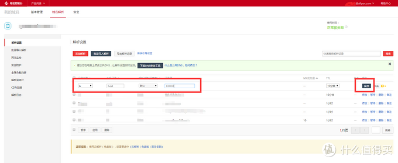](https://post.smzdm.com/p/a6mvll0/pic_4/)

2. 点击右上角的用户账号，【accesskey】，如下图：

   

   [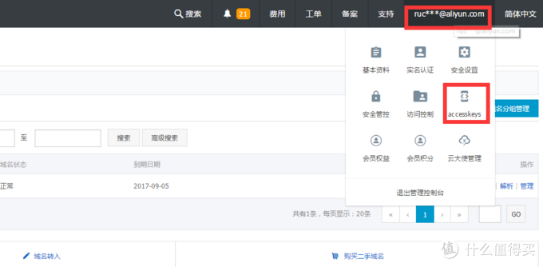](https://post.smzdm.com/p/a6mvll0/pic_5/)

3. 一路【同意】就行并创建新的key，然后点击显示accesskey，将下图两个值复制下来，

   

[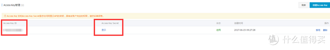](https://post.smzdm.com/p/a6mvll0/pic_6/)

​    4.下载插件https://github.com/rfancn/aliyun-ddns-client,

[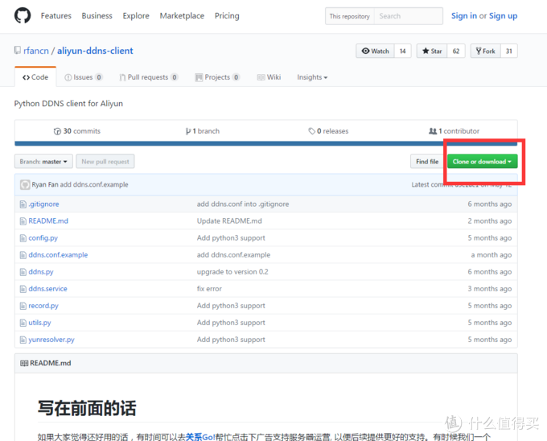](https://post.smzdm.com/p/a6mvll0/pic_7/)

​    5.回到群晖，安装Python，开启ssh（22端口），

[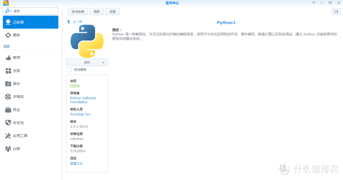](https://post.smzdm.com/p/a6mvll0/pic_8/)

[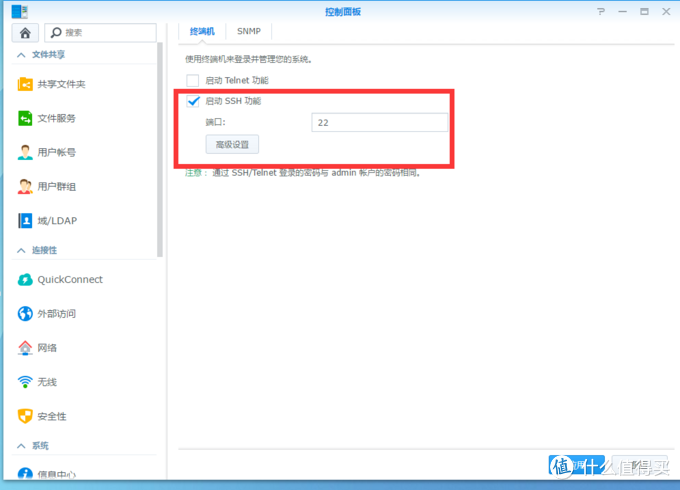](https://post.smzdm.com/p/a6mvll0/pic_9/)

​    6.下载WinSCP，用于上传插件到群晖，连接群晖，用户名要用root，密码就是网页登陆的admin的密码，如下图：

[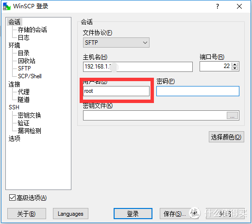](https://post.smzdm.com/p/a6mvll0/pic_10/)

7.进去以后，我是在根目录新建了一个【aliyun】的[文件夹](https://www.smzdm.com/fenlei/wenjianjia/)，

[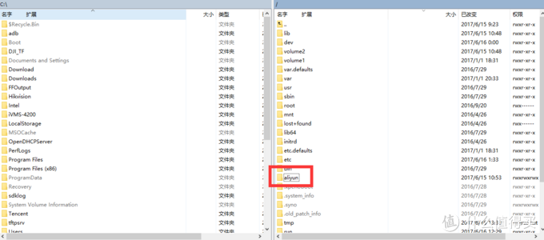](https://post.smzdm.com/p/a6mvll0/pic_11/)8.把插件解压出来后拖入新建完的文件夹内，将【ddns.conf.example】文件名重命名为【ddns.conf】双击打开修改文本内容，在access_id和access_key对应填入刚才阿里云复制下来的字符串，修改domain为您的顶级域名，在sub_domain填入刚才建好的解析主机名，例如host，【保存】并关闭窗口：

[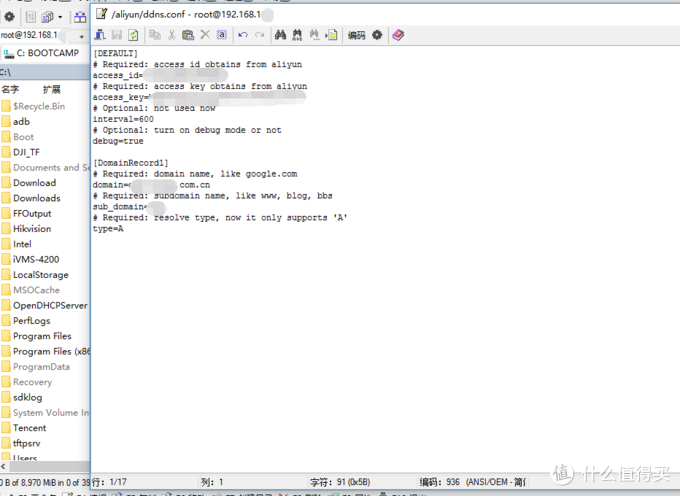](https://post.smzdm.com/p/a6mvll0/pic_12/)

9.返回上一级目录，右键目录，点击属性，修改权限0777如图，并勾选【循环设定组、拥有着和权限】：

[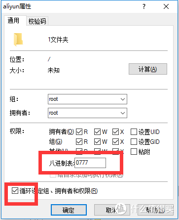](https://post.smzdm.com/p/a6mvll0/pic_13/)10.进入群晖【控制面板】，【计划】，

[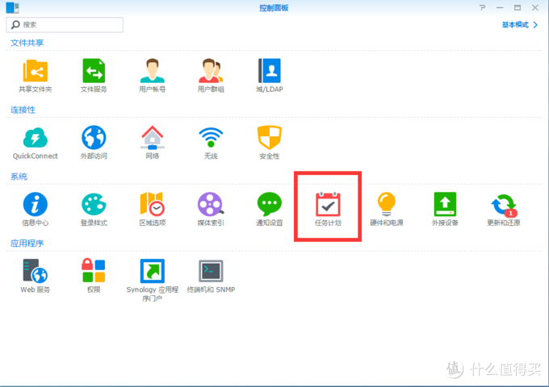](https://post.smzdm.com/p/a6mvll0/pic_14/)

11.新建任务，设定时间，时间间隔看个人需要，

[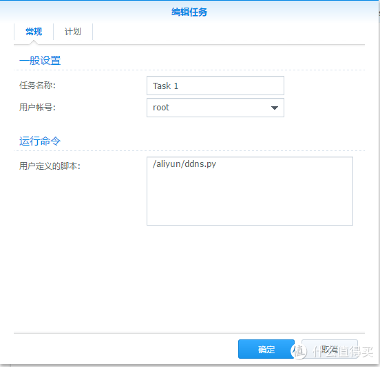](https://post.smzdm.com/p/a6mvll0/pic_15/)

[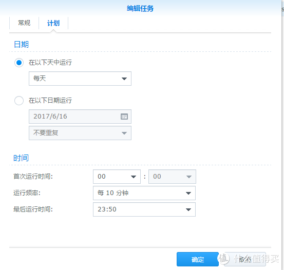](https://post.smzdm.com/p/a6mvll0/pic_16/)

12.完成以后可以测试，选中任务后点击【运行】，

[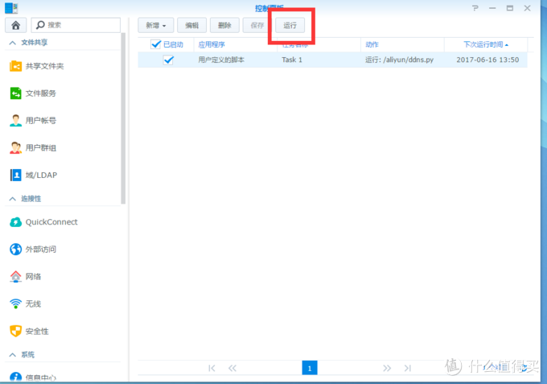](https://post.smzdm.com/p/a6mvll0/pic_17/)

可以登陆阿里云域名解析查看原来的ip地址栏的0.0.0.0是否已经变成现有外网的IP。

完成。