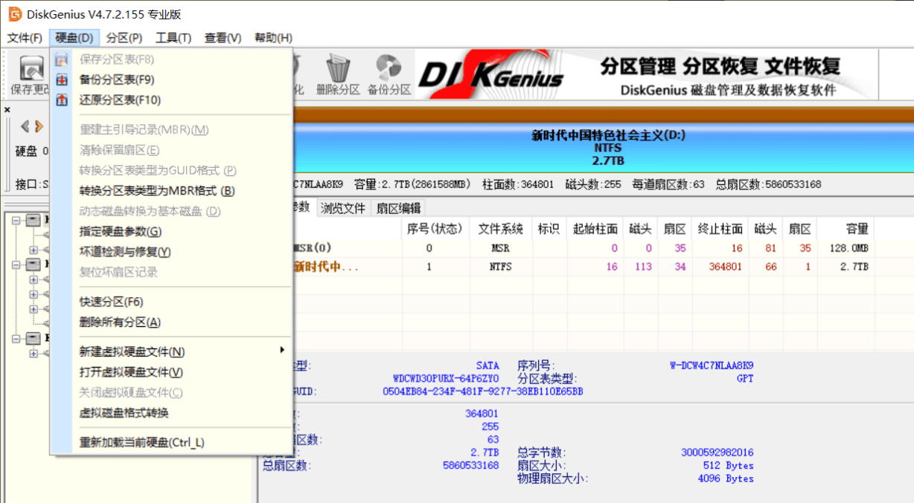
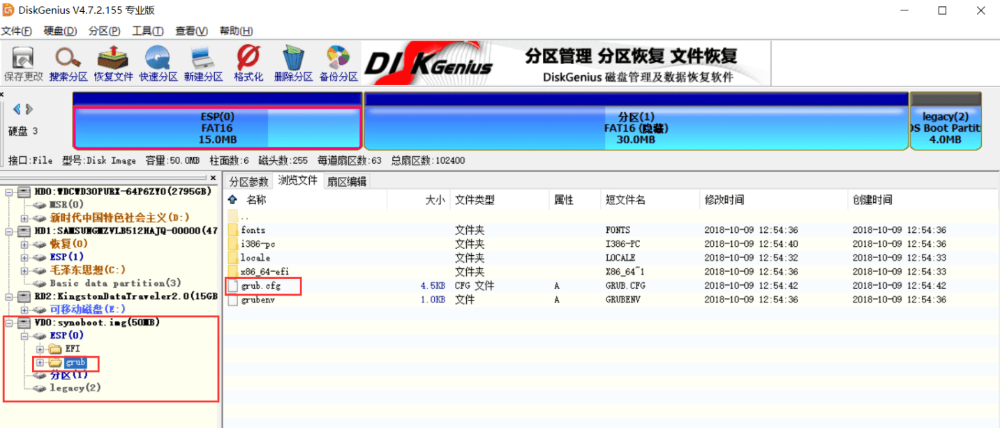
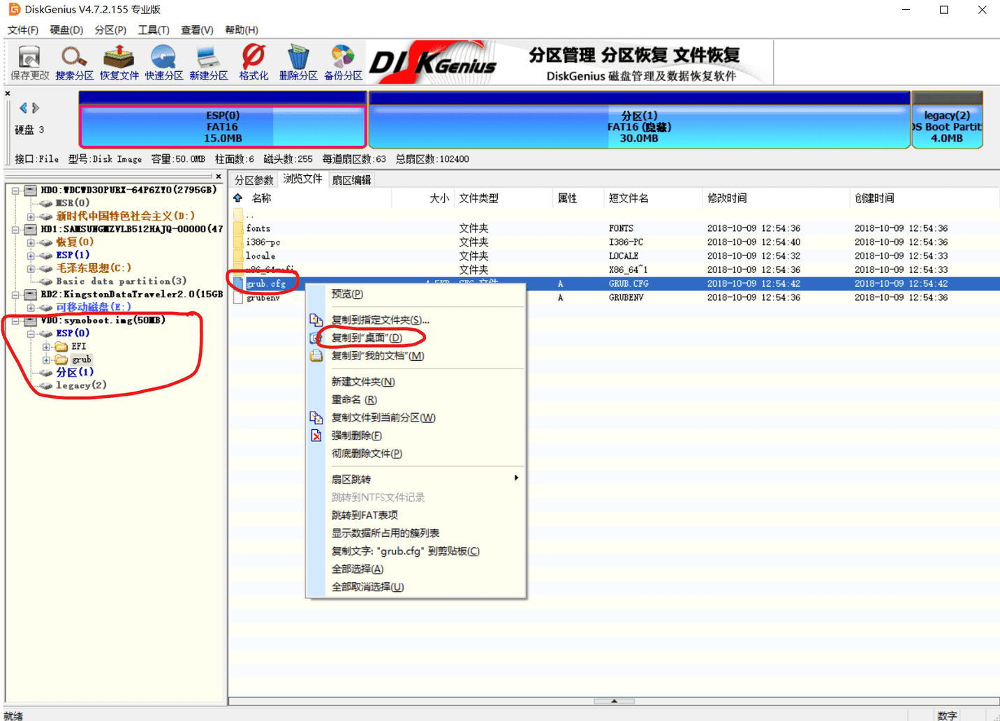
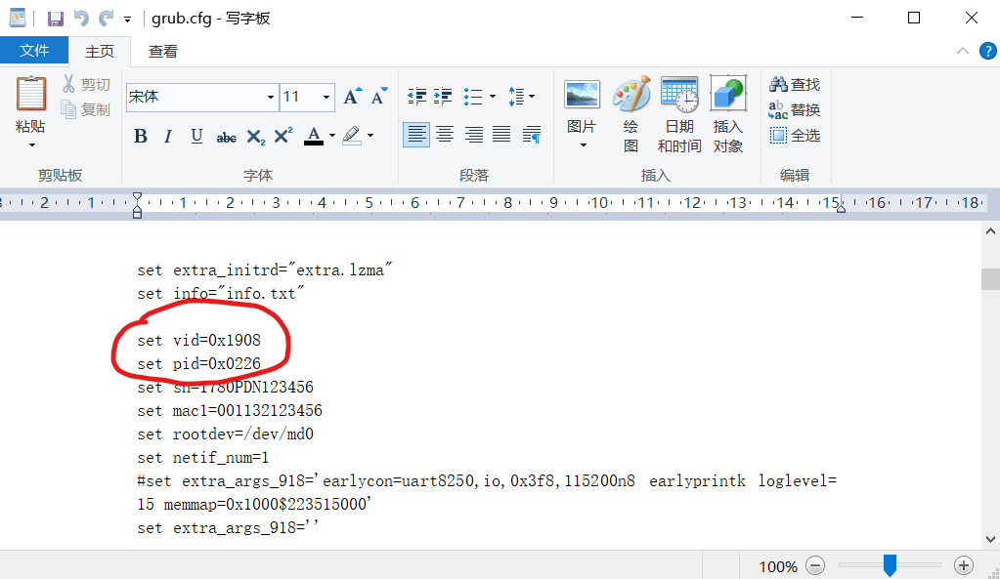
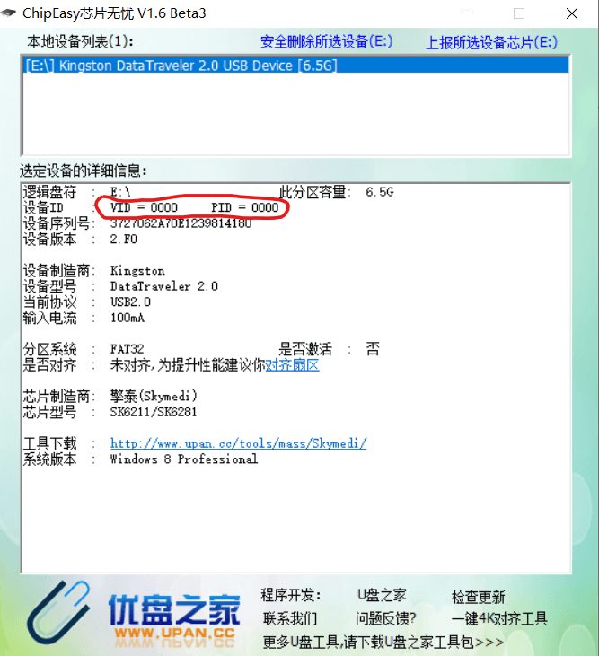
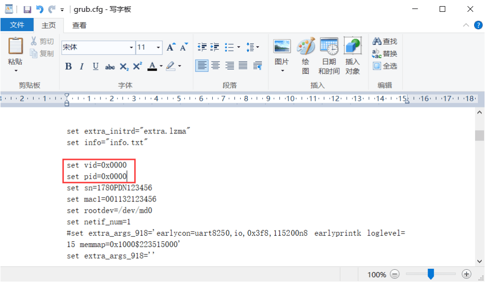
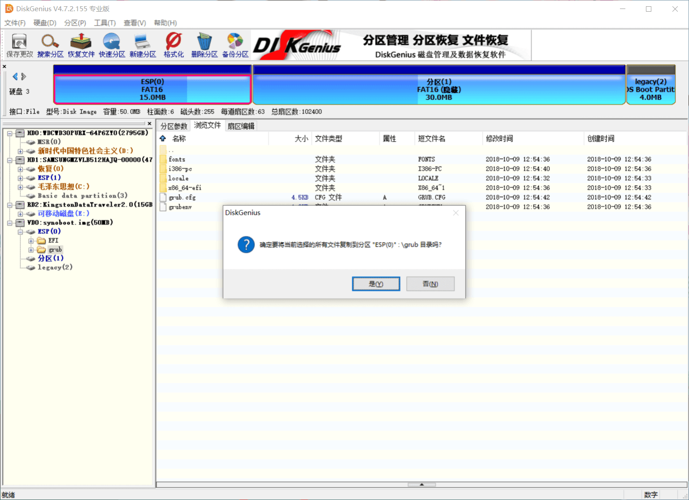
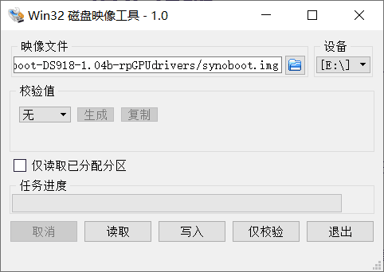
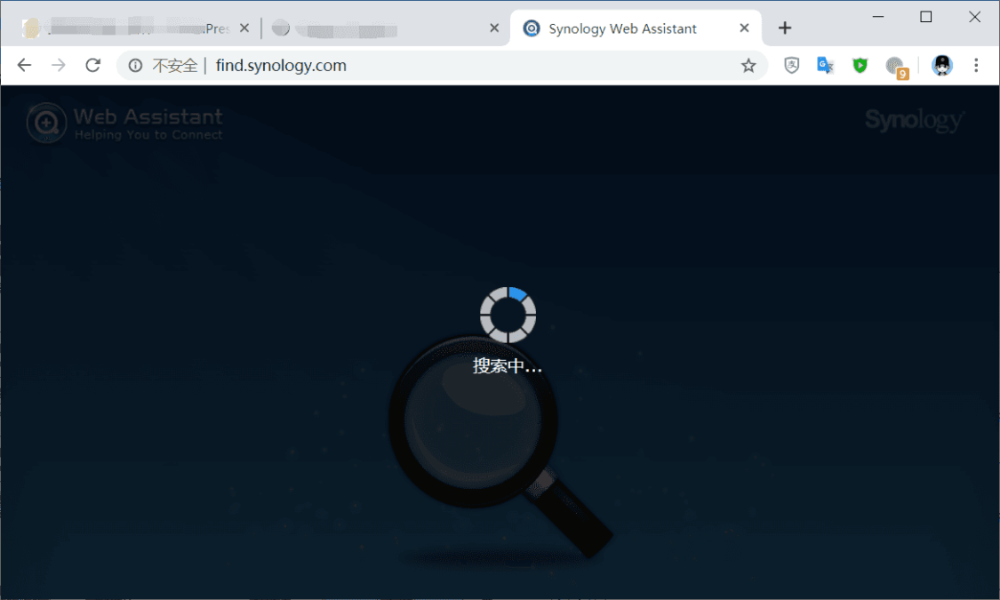

## 使用到的工具及软件

1.由nas2x论坛大神Ardentwheel修改的1.04b引导。原帖地址： https://www.nas2x.com/threads/asrock-j3455-itx-ds918-1-04b-loader.615/ ；引导下载链接：https://mega.nz/#!keAhECwC!9NwuIsJ_ZacjUdcSxBC508V6fa_VYH8Qbypv_K9iZKA；下载后解压得到synoboot.img镜像文件

2.群晖DSM6.22。下载地址：https://archive.synology.com/download/DSM/release/6.2.2/24922/DSM_DS918+_24922.pat

3.DiskGenius。下载地址：https://www.nas2x.com/downloads/diskgenius-4-9-6-564.17/

4.芯片无忧。下载地址：https://www.nas2x.com/downloads/chipeasy-en-chs.10/

5.Win32 Disk Imager 1.0.0 简体中文 。下载地址：https://www.nas2x.com/downloads/win32-disk-imager-1-0-0.2/

6.优盘一个。8G就够了，大于8G也行，只不过剩余空间也是浪费。

## 引导盘制作

1.使用DiskGenius打开synoboot.img。打开方式：启动软件后点击“硬盘”—“打开虚拟硬盘文件”。

2.依次展开虚拟磁盘的“ESP”—“grub”，在右边找到grub.cfg，右键—复制到“桌面”。

3.使用写字板或者其他文本编辑工具打开桌面上的grub.cfg文件，找到”set vid=0x1908″和”set pid=0x0226″。

4.插入优盘，打开“芯片无忧”，稍等片刻找到vid和pid，将此处的vid和pid后面的四位数分别填写到上一步写字板中的set vid和set pid处替换原来的值，注意：原来的值前面的0x表示16进制，不要删除。替换后保存文件。

我的优盘的vid和pid就是0000，不要好奇

5.复制桌面上修改后的grub.cfg文件，回到上面第1部打开的界面安键盘上的”Ctrl”+”V”，提示是否粘贴选是，询问是否覆盖选覆盖。

将自己优盘的vid和pid填到这里

6.安装下载好的 Win32 Disk Imager 1.0.0 简体中文 。启动软件，选择刚才修改好的synoboot.img，确认优盘盘符是否正确，点击写入，等待完成。

7.至此，启动盘制作完成。拔下优盘，插入暴风酷播云上

## 安装黑群晖

1.显示器接上暴风酷播云，开机不停按键盘的F11,(是不停的按，不是按着不放）。弹出选项后按上下键选择你的优盘（优盘一般带有USB字样），选带有UEFI字样的。按回车启动

2.暴风酷播云接入网络，并保证和家里的计算机在同一个路由器下。

3.在计算机上打开浏览器，输入网址[http://find.synology.com](http://find.synology.com/)进入搜索群晖界面。

4.搜到群晖后根据提示设置，但在选择安装DSM是点击”手动安装”，选择我们下载好的pat格式的系统文件进行安装。根据提示一路安装即可。

这里选择手动安装