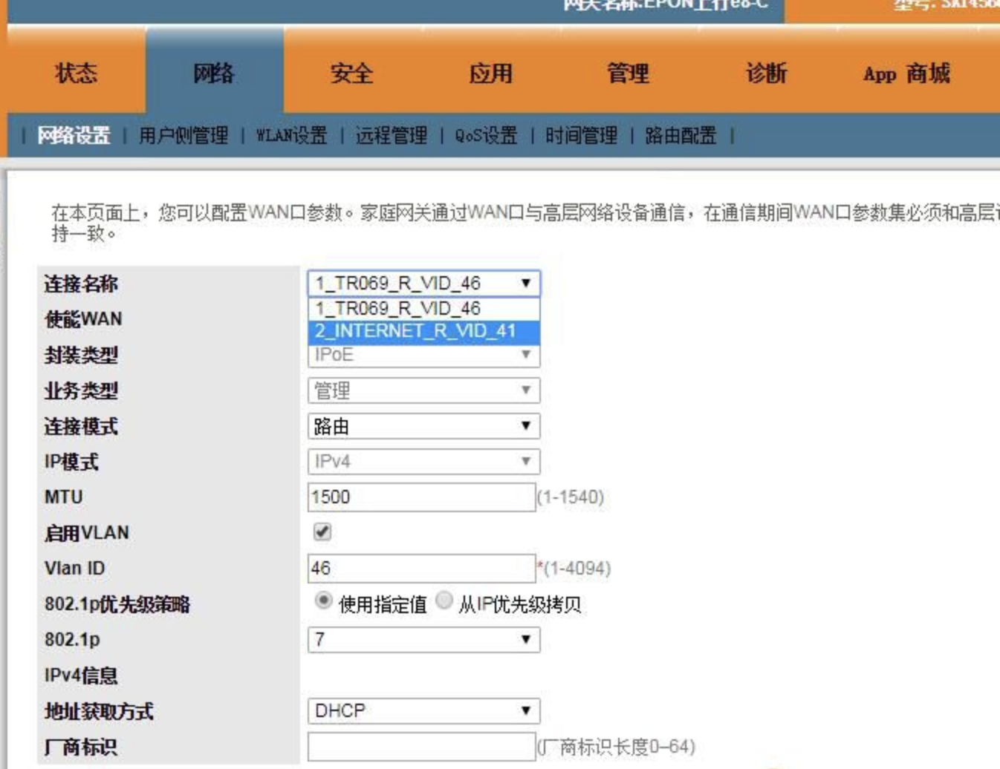
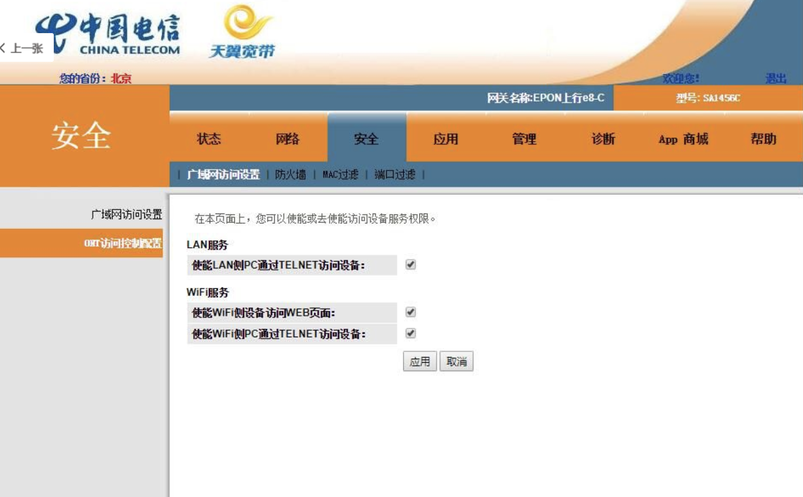

+++
title = "光猫TTL破解"
template = "page.html"
date = "2019-08-21"
updated = "2020-05-05"
+++


实用 TTL 破解还是挺简单的

主板上的 1、4、5 分别接 TTL 线的 TX，GND，RX，用 PUTTY 选择串口模式（具体看设备管理器的串口号），速率设为 115200。


华为悦 SA1456C 引脚图：从 J8 向右看 5 个针角分别为 Rx、Vcc、Nc、Gnd、Tx

，打开后光猫通电就可以接收到信息，等信息开始停止滚动后按 ENTER 键输入帐号：root，密码：adminHW（注意大小写），然后输入“restore manufactory”，就恢复出厂默认了，超级用户密码就变成了“nE7jA%5m”，进入光猫就能重新选择区域注册了。


**显示系统版本：**

su

shell

?

display version

刷入完整的 shell

load pack by tftp svrip 192.168.100.2 remotefile payload-mod.bin


------

我买的固件版本如下：
```txt
originalVersion   = V300R017C00SPC108B0002080081
customInfo        = SHCT_SMART
```

以下内容中使用的工具在这里下载：

链接：https://pan.baidu.com/s/1I-3WD2A6cGuucVKlBM11uA 提取码：x73m

文章来源：http://www.chinadsl.net/forum.php?mod=viewthread&tid=158256&extra=&page=1

另看：http://www.chinadsl.net/forum.php?mod=viewthread&tid=152756&extra=page%3D1

1、注册过的光猫首先**必须拔掉光纤线，然后保证猫上只有你进行操作的电脑这一台设备和其进行物理连接**，然后拔掉电源头再插上，慢慢等待光猫重启完毕，不要捅菊花，否则所有下发配置信息丢失，就失去操作的目的了。关于接口的使用：网上的教程都说的 lan1（标识为悦 me 口），实际上我自己疏忽，用的是 lan4，同样成功完成了后面的所有步骤，为了谨慎起见，建议连接 lan1 口。

2、补全 shell，补全 shell 后才能提取加密过的含有超密的配置文件（文件名：hw_ctree.xml，路径：/mnt/jffs2）补全方法：下载下面的文件包（包含华为使能工具和 allshell4 文件，自己测试正常使用，界面如下图）：


补 shell 的方法（这里借用坛友 @[快乐一生 2711](http://chinadsl.net/home.php?mod=space&uid=643008) 的方法）：

  a. 选择升级
  b. 选择当前路由所接入的网卡
  c. 点开升级状态页面
  d. 点击浏览，选择刚才下载并解压出来的 allshell4 文件
  e. 拔掉路由的电源，然后点击光猫破解工具下面的启动！点下启动以后，光猫重新通电！当等待右边的状态栏（点击软件上面那个大长方形按钮就出来鸟）由绿色变成红色后，点击使能工具的停止键！（变一次就行，不管出现什么状态）————第 5 步请务必按上述描述操作，从绿到红变化较快，我是变了 3 次以后点击的停止。
  f. 拔猫电源插头再插上，重启一遍光猫。

下面 3、4、5 步为了将路由器中的`/mnt/jffs2/hw_ctree.xml`文件下载到电脑中，如果已 TTL 进入 shell，可直接到第 6 步。

3、开启 telnet（我这注册成功下发配置后，光猫 telnet 被关闭，对于有些地区可能没有关闭，这步可以省略），使用 ONT 组播版本配置工具对 hw_ctree.xml 文件解缩：


使用方法：当上面步骤的第 6 小步（重启）完成后，不要进行其他操作，这时打开此工具，注意上面的 3 个红框，选择正确后，点击启动，当看到最下面的那个红框里面的数字从 0 变为 1 的时候，点击停止即可，这里最好耐心等待 40s-1 分钟左右。完成以后，同样拔插光猫电源插头，重启一遍。

4、上面 3 步完成之后，就可以通过 telnet 命令建立与光猫的连接，windows 系统事先要在控制面板——程序和功能——打开或关闭 windows 功能中勾选 telnet 客户端——确定，然后打开 cmd（开始菜单——附件——命令提示符），输入 telnet 192.168.1.1    #（地方版本光猫的默认访问地址），回车，然后在 login 处输入用户名：root 回车，然后输入密码（这里的密码是没有*号显示的，别输错就行）：adminHW，然后得到 Wap>提示符的界面，输入 su 回车提权，然后输入 shell 回车，启动 busybox shell 命令集，接着输入 cd /mnt/jffs2 回车，再输入 ls 能看到列表说明 shell 补全成功。

5、接下来，我们需要一个程序，TFTP64（我是 64 位系统，自己下载对应版本即可，下载地址：https://bitbucket.org/phjounin/tftpd64/wiki/Download%20Tftpd64.md，下载以后，直接解压到桌面任意文件夹，打开程序如下图：


注意上图打框的地方，这个要选光猫给你 dhcp 的局域网地址，不要选 127.0.0.1，搞定以后，这个程序最小化，不要关闭。

6、下载含有超密的加密配置文件：
前面我们通过 telnet 建立和光猫的连接，继续在那个命令行窗口中输入以下命令并回车：
```bash
tftp -p -l hw_ctree.xml 192.168.1.2
```
完成后，打开刚才桌面解压 tftp 软件的那个文件夹，hw_ctree.xml 这个文件就已经在里面了。

7、解密配置文件，打开 huaweiXML_CFG_配置文件解密工具文件。


这个的用法就不用我说了，直接选择刚才那个下载的 hw_ctree.xml 文件，点击解密，会在 tftp 目录里面生成 1 个新的同名文件，老文件自动加上 old 前缀

8、查询密码：

将解密后的 xml 文件，用 notepad++ 打开（网上随便下），然后点击搜索——输入 telecomadmin——查找下一个，密码就出来鸟！（如下图）


至此，获得超密过程结束，以后你如果不用坛子里面提供的恢复原始超密的办法（更改注册地区），这个超密是一直管用的，上面补全的 shell，不刷机的话也是一直有效的


-------


首先声明一下，我不是高手，更不是大牛，一切资源都在论坛找的！但是呢，那些真正的高手，语焉不详，对我们这些菜鸟爱理不理！我写这篇文章，仅仅是为了让广大小白，少走弯路！人生，就在于折腾中找成就感！！！第一次接触华为光猫，是忍受不了电信送的天邑光猫动不动就卡顿延时。从某宝入手了一个 298 元全新的 SA1456C，傻瓜型的，全自动下发，用了一段时间，感觉不错，想着给另外一套房子也装一个，就在某宝搞了一个二手的，75 元！（看到这个，心中顿时一群草泥马狂奔而过！！）但是，收到货以后，顿时崩溃了，搞来搞去，无法破解超密，折腾了两天，无奈，又去某宝，找人破解了一下，花了 30 块大洋！钱花了是小事，卖家的态度拽的很，心理就不爽了。于是，再度去某宝搞了一个二手的 SA1456C，折腾从此开始了！！！好了，废话不多说，言归正传！# f; ^) I" m F3 @4 x* U/ b: @5 H- C- [
第一步：什么 TTL，什么使能，折腾到来，不是太麻烦，就是解决不了你的问题！二手猫买回家，不管三七二十一，上电捅他菊花！用牙签之类的东西，按住 reset 键 20 秒！然后等待光猫重启完毕以后，用 360 浏览器极速模式，或者谷歌浏览器等等，登录：192.168.1.1(PS: 我买的都是电信页面的，华为页面的没买过，不晓得！)' q W4 l2 E: a3 W4 N0 [
以下是 SA1456C 的操作页面！！！
1、设备注册

2. 更改地址（如果没有修改地址的选项，通常都是比较老的版本，直接使用使能工具破解即可！！！）

3、然后会进入到输入密码页面，（我们当然是没有超级密码了，有密码就不用这样折腾！) 在当前页面点击右键，检查，然后会出来代码页面！在代码页面，可以看到图中所显示的，已经方框指出！注意，是尾巴有：areastep 字样的那个选项！
在这边双击选中，并且删除它；
然后回到浏览器页面，任意位置单击，就可以看到选择地区的选项了！然后选择：北京，等待几秒钟，回到登录页面
PS: 这边说明一下，貌似只有选择北京地区，后续才可以自己随意设置不弹窗！
接着回到登录页面，超级账号：telecomadmin，超级密码：nE7jA%5m，登录成功！
设置网络，照着旧光猫设置就可以了，一个是 Vlan46 的管理，Vlan45 的语音，Vlan41 的 PPPOE 拨号



开启 telnet（安全）



接下来我们要做的，应该就是补全 shell 了。补全 shell 不同的固件版本，需要的文件是不一样的。关于 R016 补全 shell 的教程，论坛上面有很多，我就不说明了，我们只说 R017 补全 shell。
首先，我们先给电脑开启 telnet 客户端功能） d# R1 ~4 @* i2 [1 n) |
 3 D4 Y( L' \+ t3 a! I$ x
 - E# Q- \9 A7 X! w# T% O

然后打开 cmd$ ], E, e* s; F5 ^7 c, X: X

进入 CMD 页面，输入 telnet 192.168.1.1（默认 IP 地址，自己有更改，请对照自己设置的 IP），账户：root，电信页面密码：adminHW，华为页面密码：admin。（貌似是这样的），接着：display version，就可以看到你的版本号了！这边是 R017 的版本，可以参照下面的方法补全 shell，补全 shell 能干啥？改双模，改 MAC 地址，改 SN 序列号等等等等！) I0 f$ V& E4 Z
 0 [6 {' s, k1 Z, v1 U
如果是 R017 版的，那么我们继续！先下载附件 Ont 使能与 allshell4 的压缩包，回去后解压！然后打开 ont 使能工具。
 [allshell4.rar](http://www.chinadsl.net/forum.php?mod=misc&action=attachpay&aid=78353&tid=152756) *(8.44 KB, 下载次数：562, 售价：20 猫粮）*

 [ont 使能.rar](http://www.chinadsl.net/forum.php?mod=misc&action=attachpay&aid=78354&tid=152756) *(1.82 MB, 下载次数：534, 售价：20 猫粮）*
1、选择升级 4 B( q, l3 R, V9 [* F5 ~0 Y
2、选择当前路由所接入的网卡 4 h6 b9 R6 L9 t, \5 j: @6 {
3、点开升级状态页面* n! e5 C- _2 }- A, r
4、点击浏览，选择刚才下载并解压出来的 allshell4 文件
5、最重要的一点，这个是能否成功的关键！！！当上面步骤全部完成，拔掉路由的电源！拔掉路由的电源！拔掉路由的电源！然后点击使能下面的启动！点下启动以后，路由重新通电！当等待右边的状态栏由绿色变成红色后，点击使能工具的停止键！（你不点停止，它会一直在那边变色，变色一次就可以停止了！)0 x' U- D) y- c- _: D
 " U. N4 Q% P+ d$ F8 U5 Q/ {
 ' @8 ^+ |0 V: ^! e" s; _. u
此时光猫应该是几个灯同时闪烁不停 / x2 d x( g" P1 J# w$ Q
 : \4 C; z: l5 z8 H* y( Y! W

自此，升级完成并且开启了全 shell 功能！再次拔掉电源，重启光猫！
/ S7 D: }- k* y7 f+ B
现在让我们来验证一下，打开 CMD，登录 telnet，输入账号，密码，提权 SU，shell，然后 CD LS) ?$ S0 q, b, j: {5 L4 q) _
telnet 192.168.1.1
root
adminHW
su
shell: R1 i1 {) A4 l9 I6 K
cd /mnt/jffs2
ls
得到这个界面，就是 shell 成功！CD 失败，就是未获取全 shell，重新操作上一步。经过本人验证，R017 的 SA1456C 和 HS8145V，都可以获取全 shell。是我买的几个都可以，不代表全中国！！！
 - A' |6 Q2 v% z) T. k
这下就可以改双模，改 MAC，改 SN 序列号等等，具体操作如下，
键入：vi hw_boardinfo 回车
找到 obj.id = "0x00000001" ; obj.value = "4"; 这里，8 v$ W5 [, j7 [: A, ]& A- x
英文状态下按字母：i  ，进入编辑模式，
然后把光标移动到后引号下面，Backspace 删除，把 2 改成 4,(1 代表 GPON,2 代表 EPON,4 代表 E/G 双模）,
按 esc, 然后输入：wq 回车（注意冒号不能漏）, 然后 reboot，重启光猫！1 i. e: |' [% R2 Q0 z$ ?/ y$ f% a

以下是各个参数的说明！！！以下是论坛找的
obj.id = "0x00000001" ; obj.value = "4";    1 光模式修改：4 为双模 2 为 EP  1 为 GP/ W; e1 _, r: O7 [) s
obj.id = "0x00000002" ; obj.value = "485754444AB7AB9A";    2 标签上的 PON NO. W8 w: d/ Z; U
obj.id = "0x00000003" ; obj.value = "";
obj.id = "0x00000004" ; obj.value = "";
obj.id = "0x00000005" ; obj.value = "";
obj.id = "0x00000006" ; obj.value = "";
obj.id = "0x00000007" ; obj.value = "044BBBAGH6001122";    7 此处不用改 $ ~3 H7 ?9 ]; K& F2 _) F( h
obj.id = "0x00000008" ; obj.value = "2150083444AAA6000999"; 8 标签上的 PROD ID
obj.id = "0x00000009" ; obj.value = "";
obj.id = "0x0000000a" ; obj.value = "F8:55:88:88:84:C0";  重要：修改 MAC 只可修改前 11 位，往下要全换
obj.id = "0x0000000b" ; obj.value = "F8:55:88:88:84:C8";$ \- K7 z8 F/ j- f+ N) @- M
obj.id = "0x00000022" ; obj.value = "F8:55:88:88:84:C9";  最后一位是数值，不能改！
obj.id = "0x00000023" ; obj.value = "F8:55:88:88:84:CA";
obj.id = "0x00000024" ; obj.value = "F8:55:88:88:84:CB";$ N* ~5 f6 t0 @9 x3 r% a
obj.id = "0x0000002d" ; obj.value = "F8:55:88:88:84:CC";2 z N! A, u8 n7 W5 t$ s8 F1 r4 M/ L
obj.id = "0x0000002e" ; obj.value = "F8:55:88:88:84:CD";
obj.id = "0x0000002f" ; obj.value = "F8:55:88:88:84:CE";
obj.id = "0x00000030" ; obj.value = "F8:55:88:88:84:CF";: p9 }$ l( `; K! f/ }
obj.id = "0x0000000c" ; obj.value = "F8:55:88:88:84:C1";& S6 r' W; g6 e' p( g% q+ u
obj.id = "0x0000000d" ; obj.value = "F8:55:88:88:84:C2";
obj.id = "0x0000000e" ; obj.value = "F8:55:88:88:84:C3";
obj.id = "0x0000000f" ; obj.value = "F8:55:88:88:84:C4";
obj.id = "0x00000010" ; obj.value = "F8:55:88:88:84:C5";
obj.id = "0x00000011" ; obj.value = "F8:55:88:88:84:C6";3 i9 O, H* i6 d7 V# i; L0 o& ~' C
obj.id = "0x00000012" ; obj.value = "F8:55:88:88:84:C7";
obj.id = "0x00000013" ; obj.value = "F8:55:88:88:84:C0";! M( f- p' r! q0 W
obj.id = "0x00000025" ; obj.value = "F8:55:88:88:84:C0";
obj.id = "0x00000026" ; obj.value = "";
obj.id = "0x00000027" ; obj.value = "";
obj.id = "0x00000028" ; obj.value = "";
obj.id = "0x00000029" ; obj.value = "";1 [5 y: ~, F C! x
obj.id = "0x0000002a" ; obj.value = "";$ v5 N! r( _4 o& W$ o2 I8 {0 M
obj.id = "0x0000002b" ; obj.value = "";
obj.id = "0x0000002c" ; obj.value = "";
obj.id = "0x00000016" ; obj.value = "";, m! ]. q: i' Y) e" a
obj.id = "0x00000018" ; obj.value = "0";  18 移动为 0，联通为 2
obj.id = "0x00000019" ; obj.value = "";
obj.id = "0x0000001a" ; obj.value = "E8C"; 1a 移动为 CMCC，联通为 COMMON
obj.id = "0x0000001b" ; obj.value = "BJCT"; 1b 移动为 BJCMCC_RMS，联通为 SHCU! z7 F+ T1 Y! E% Q/ @( O
obj.id = "0x0000001c" ; obj.value = "0";% r3 s' L \3 V/ p/ |
obj.id = "0x0000001d" ; obj.value = "1";- O9 F$ A" Z+ S+ ~, a a. o, \( R B$ |
obj.id = "0x0000001e" ; obj.value = "1";
obj.id = "0x0000001f" ; obj.value = "1";( N& H" s, _7 ~9 M% ~* D0 s
obj.id = "0x00000020" ; obj.value = "";; T& U: t6 A4 |+ H/ y2 Z" d# T( j
obj.id = "0x00000021" ; obj.value = "0";
obj.id = "0x00000031" ; obj.value = "CHOOSE_XINAN"; 31 移动 CHOOSE_CMCC_RMS2，联通 CHOOSE_UNICOM% D% t& D, N& M: O- F) Y7 X3 |
obj.id = "0x00000034" ; obj.value = "00:00:00:00:00:0C";  34 默认数据不用改"
obj.id = "0x00000036" ; obj.value = "";
obj.id = "0x00000037" ; obj.value = "";' @ ^) ~& {/ o9 v' K
obj.id = "0x00000038" ; obj.value = "";. q+ a4 v& b: b$ q
obj.id = "0x00000035" ; obj.value = "";  35 只有移动填入 SMART ，电信、联通此处无数据 & ~, z5 X( t8 r! u9 X
obj.id = "0x00000039" ; obj.value = "0x00102001"; 39 包括此处往下为默认数据不可修改） A h% Y* v- J5 a4 J4 P
obj.id = "0x0000003a" ; obj.value = "@@&@&@&@&@&";
obj.id = "0x0000003b" ; obj.value = "";9 v3 O! A6 m& {- z
obj.id = "0x0000003c" ; obj.value = "0x00102001";
obj.id = "0x0000003d" ; obj.value = "0x00000000";+ }4 C+ y# H& i5 b& `' E1 V' c, @
obj.id = "0x0000003e" ; obj.value = "0x00000000";
obj.id = "0x0000003f" ; obj.value = "0x00000000";9 d) F; f4 X1 K' T
obj.id = "0x00000040" ; obj.value = "";
obj.id = "0x00000041" ; obj.value = "";1 U. P5 E( @3 ~6 i: C
[ j1 A: F K5 V1 h
到此本来应该一切都结束了，然！生命不休，折腾不息，之前买的 298 元的那个 SA1456C（这个是 R016），出现了一个很奇葩的问题，WIFI 同时连接 4 个以上设备时，当其中任意一个 WIFI 断开，光猫会无故重启，当时以为是电信页面的问题，就改到了华为页面，但是依然会这样！6 v: O7 j* F: w
电信页面改华为页面操作方法，在进入 shell 页面以后，输入：restorehwmode.sh，（请谨慎操作）
PS：这边说明一下，华为页面真心不如电信页面！没有什么更加强大的功能，强烈建议大家保留电信页面！！！毕竟，切换到华为页面，就一条命令的事情，随时都可以，但是要回复电信页面，你要折腾很久很久！！！

由于经常无故重启，于是我就想给它把固件升级到 R017 去，找来找去，看中了重磅的那个固件！于是用使能工具刷入！于是悲催的人生开始了，刷入以后，WIFI 灯不亮了，WEB 页面打不开，无法进行设置。折腾来折腾去，WEB 页面可以打开了，但是不管什么账号密码，通通无法登录。后来，实在没办法了，找到了一个 HS8145V 的 R107 固件，于是抱着破罐子破摔的心态，把 HS8145C 的 R017 固件刷入了 SA1456C！当时是在华为页面刷入的，刷入以后无法自动获取 IP，需要进行手动设置，网关为：192.168.100.1，然后浏览器打开 192.168.100.1:8080（不知道为什么，后面必须加 8080 的端口，不然网页无法显示），选择地区，重置密码，然后一切就变得跟以前一样了...... 同时，这个固件已经自带全 shell，一切就是这么简单！我这两天又经过测试，SA1456C 的 R017 版本，无法刷入这个固件，不知道是什么原因！4 Q1 U- ?' a9 C* L2 l
PS：ONT 使能工具的正确升级方法，设置好使能工具，断开光猫的电源，然后先点启动使能工具，再给光猫通电，等待右侧状态栏升级完毕！
 [R017.part1.rar](http://www.chinadsl.net/forum.php?mod=misc&action=attachpay&aid=78361&tid=152756) *(7.5 MB, 下载次数：186, 售价：30 猫粮）*
9 q; Z- a3 f' P
 [R017.part2.rar](http://www.chinadsl.net/forum.php?mod=misc&action=attachpay&aid=78362&tid=152756) *(7.5 MB, 下载次数：133, 售价：30 猫粮）* 0 x4 t+ w! D. |$ ?- C- G: S* X
! y0 }+ e2 O0 ~1 W. o% C
 [R017.part3.rar](http://www.chinadsl.net/forum.php?mod=misc&action=attachpay&aid=78363&tid=152756) *(7.5 MB, 下载次数：130, 售价：30 猫粮）*
' g) F& n1 f9 D/ C% E0 u8 M2 S/ I% `
 [R017.part4.rar](http://www.chinadsl.net/forum.php?mod=misc&action=attachpay&aid=78364&tid=152756) *(7.5 MB, 下载次数：131, 售价：30 猫粮）* % y; t' k/ z. ^
9 H* W9 L4 G: y, D% U
 [R017.part5.rar](http://www.chinadsl.net/forum.php?mod=misc&action=attachpay&aid=78365&tid=152756) *(7.5 MB, 下载次数：120, 售价：30 猫粮）*
6 \) h8 o4 s; C0 G; o; {; i! r
 [R017.part6.rar](http://www.chinadsl.net/forum.php?mod=misc&action=attachpay&aid=78366&tid=152756) *(1.94 MB, 下载次数：103, 售价：30 猫粮）* + m, i) R( U N" m( J

真是无语，居然说我骗猫粮！放开主题，提高附件售价！怒了！！！! o9 a A$ O" t) n1 ~
& E! q7 n, C3 A1 Z


-------

刷回华为界面：http://www.chinadsl.net/forum.php?mod=viewthread&tid=150870&highlight=SA1456C
