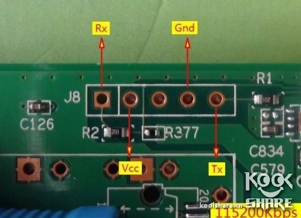
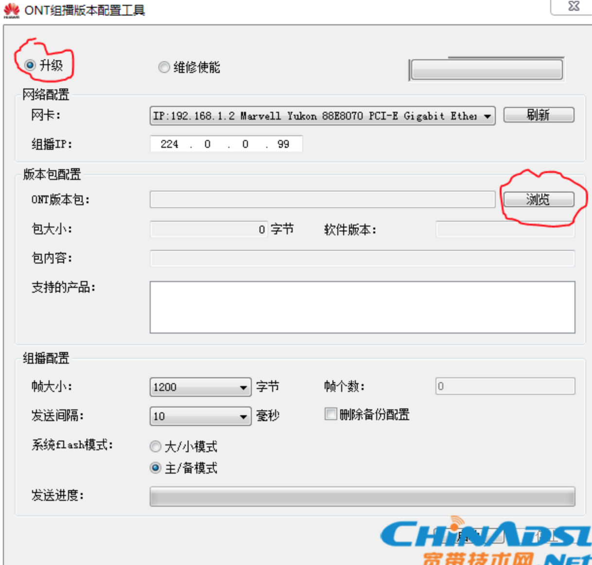
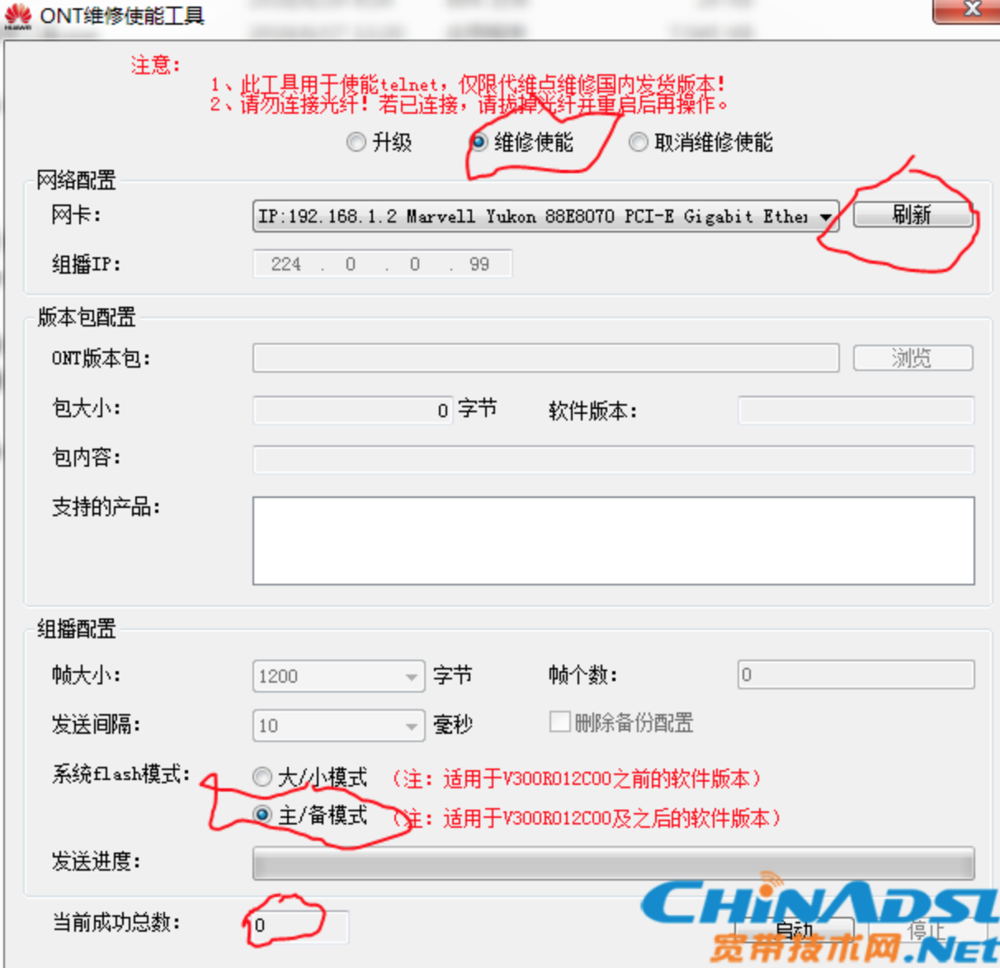
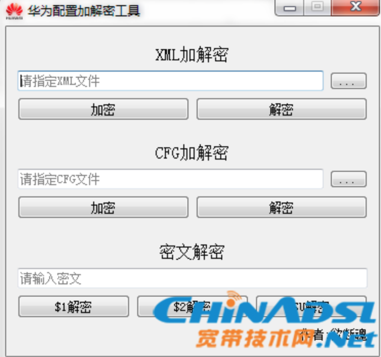
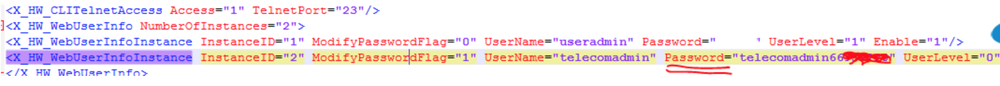

实用TTL破解还是挺简单的

主板上的1、4、5分别接TTL线的TX，GND，RX，用PUTTY选择串口模式（具体看设备管理器的串口号），速率设为115200。



华为悦 SA1456C 引脚图：从J8向右看5个针角分别为 Rx、Vcc、Nc、Gnd、Tx

，打开后光猫通电就可以接收到信息，等信息开始停止滚动后按ENTER键输入帐号：root，密码：adminHW（注意大小写），然后输入“restore manufactory”，就恢复出厂默认了，超级用户密码就变成了“nE7jA%5m”，进入光猫就能重新选择区域注册了。


**显示系统版本：**

su

shell

?

display version

刷入完整的shell

load pack by tftp svrip 192.168.100.2 remotefile payload-mod.bin


------

我买的固件版本如下：
```txt
originalVersion   = V300R017C00SPC108B0002080081
customInfo        = SHCT_SMART
```

以下内容中使用的工具在这里下载：

链接: https://pan.baidu.com/s/1I-3WD2A6cGuucVKlBM11uA 提取码: x73m

文章来源：http://www.chinadsl.net/forum.php?mod=viewthread&tid=158256&extra=&page=1

另看：http://www.chinadsl.net/forum.php?mod=viewthread&tid=152756&extra=page%3D1

1、注册过的光猫首先**必须拔掉光纤线，然后保证猫上只有你进行操作的电脑这一台设备和其进行物理连接**，然后拔掉电源头再插上，慢慢等待光猫重启完毕，不要捅菊花，否则所有下发配置信息丢失，就失去操作的目的了。关于接口的使用：网上的教程都说的lan1（标识为悦me口），实际上我自己疏忽，用的是lan4，同样成功完成了后面的所有步骤，为了谨慎起见，建议连接lan1口。

2、补全shell，补全shell后才能提取加密过的含有超密的配置文件（文件名：hw_ctree.xml，路径：/mnt/jffs2）补全方法：下载下面的文件包（包含华为使能工具和allshell4文件，自己测试正常使用，界面如下图）：




补shell的方法（这里借用坛友@[快乐一生2711](http://chinadsl.net/home.php?mod=space&uid=643008)的方法）：

  a. 选择升级
  b. 选择当前路由所接入的网卡
  c. 点开升级状态页面
  d. 点击浏览，选择刚才下载并解压出来的allshell4文件
  e. 拔掉路由的电源，然后点击光猫破解工具下面的启动！点下启动以后，光猫重新通电！当等待右边的状态栏（点击软件上面那个大长方形按钮就出来鸟）由绿色变成红色后，点击使能工具的停止键！(变一次就行，不管出现什么状态)————第5步请务必按上述描述操作，从绿到红变化较快，我是变了3次以后点击的停止。
  f. 拔猫电源插头再插上，重启一遍光猫。

下面3、4、5步为了将路由器中的`/mnt/jffs2/hw_ctree.xml`文件下载到电脑中，如果已TTL进入shell，可直接到第6步。

3、开启telnet（我这注册成功下发配置后，光猫telnet被关闭，对于有些地区可能没有关闭，这步可以省略），使用ONT组播版本配置工具对hw_ctree.xml文件解缩：



使用方法：当上面步骤的第6小步（重启）完成后，不要进行其他操作，这时打开此工具，注意上面的3个红框，选择正确后，点击启动，当看到最下面的那个红框里面的数字从0变为1的时候，点击停止即可，这里最好耐心等待40s-1分钟左右。完成以后，同样拔插光猫电源插头，重启一遍。

4、上面3步完成之后，就可以通过telnet命令建立与光猫的连接，windows系统事先要在控制面板——程序和功能——打开或关闭windows功能中勾选telnet客户端——确定，然后打开cmd（开始菜单——附件——命令提示符），输入 telnet 192.168.1.1    #（地方版本光猫的默认访问地址），回车，然后在login处输入用户名：root 回车，然后输入密码（这里的密码是没有*号显示的，别输错就行）：adminHW，然后得到Wap>提示符的界面，输入su回车提权，然后输入shell回车，启动busybox shell命令集，接着输入cd /mnt/jffs2回车，再输入ls能看到列表说明shell补全成功。

5、接下来，我们需要一个程序，TFTP64（我是64位系统，自己下载对应版本即可，下载地址：https://bitbucket.org/phjounin/tftpd64/wiki/Download%20Tftpd64.md，下载以后，直接解压到桌面任意文件夹，打开程序如下图：


注意上图打框的地方，这个要选光猫给你dhcp的局域网地址，不要选127.0.0.1，搞定以后，这个程序最小化，不要关闭。

6、下载含有超密的加密配置文件：
前面我们通过telnet建立和光猫的连接，继续在那个命令行窗口中输入以下命令并回车：
```bash
tftp -p -l hw_ctree.xml 192.168.1.2 
```
完成后，打开刚才桌面解压tftp软件的那个文件夹，hw_ctree.xml这个文件就已经在里面了。

7、解密配置文件，打开huaweiXML_CFG_配置文件解密工具文件。



这个的用法就不用我说了，直接选择刚才那个下载的hw_ctree.xml文件，点击解密，会在tftp目录里面生成1个新的同名文件，老文件自动加上old前缀

8、查询密码：

将解密后的xml文件，用notepad++打开（网上随便下），然后点击搜索——输入telecomadmin——查找下一个，密码就出来鸟！（如下图）



至此，获得超密过程结束，以后你如果不用坛子里面提供的恢复原始超密的办法（更改注册地区），这个超密是一直管用的，上面补全的shell，不刷机的话也是一直有效的