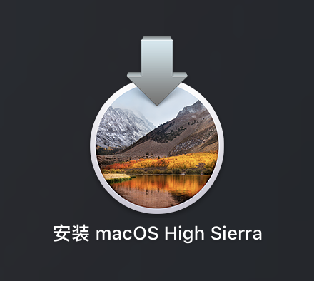
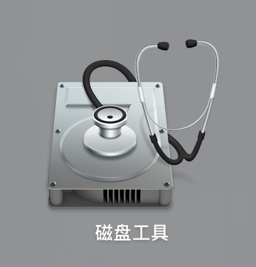
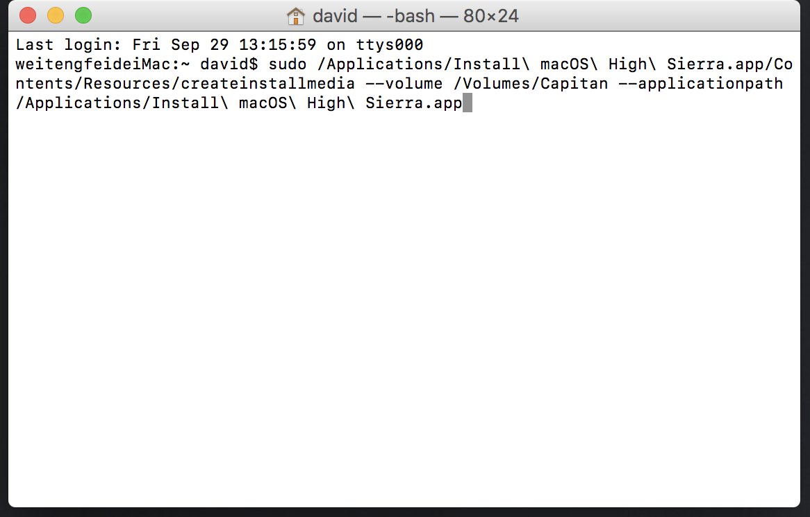
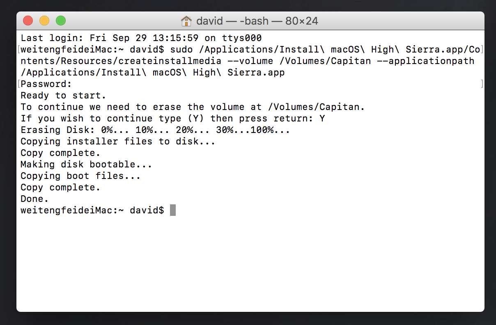

+++
title = "制作MacOS 安装U盘"
template = "page.html"
date = "2019-08-21"
updated = "2019-08-21"
+++

新的MAC OS High Sierra 正式版推出了，如何通过优盘全新安装High Sierra，以下是教程。

一、准备工作：
1.准备一个 8GB 或以上容量的 U 盘，确保里面的数据已经妥善备份好（该过程会抹掉 U 盘全部数据）
2.在你的程序应用文件夹中有刚刚从官网下载下来的 “安装 macOS High Sierra”
我这里说的是正式版，不是测试版macOS High Sierra ，这个正式版你打开App store 就可以下载.

注意：优盘一定要USB3.0的，速度一定要快，在macOS High Sierra的教程发布之后，有很多人都卡在优盘速度上。

二、格式化优盘（3.0优盘亲测可用）
1.插入你的 U 盘，然后在「应用程序」->「实用工具」里面找到并打开「磁盘工具」

2.在左方列表中找到 U 盘的名称并点击
3.右边顶部选择「分区」，然后在「分区布局」选择「1个分区」
4.在分区信息中的 「名称」输入「Capitan」 (由于后面的命令中会用到此名称，如果你要修改成其他(英文)，请务必对应修改后面的命令)

5.在「格式」中选择 「Mac OS 扩展 (日志式)」
6.这时，先别急着点“应用”，还要先在 「选项」里面，选择「GUID 分区表」
7.开始格式化

三、输入终端命令开始制作启动盘
1.请再次确保名为 “安装 macOS High Sierra” 的文件是保存在「应用程序」的目录中
2.在「应用程序」->「实用工具」里面找到「终端」并打开。也可以直接通过 Spotlight 搜索「终端」打开
3.复制下面的命令，并粘贴到「终端」里，按回车运行：
------命令开始------ 从sudo开始复制（不要复制这句话）

sudo /Applications/Install\ macOS\ High\ Sierra.app/Contents/Resources/createinstallmedia --volume /Volumes/Capitan --applicationpath /Applications/Install\ macOS\ High\ Sierra.app

------命令结束------ 到Sierra.app结束（不要复制这句话）
命令说明：
Install\ macOS\ High\ Sierra.app 这个是正式版的“macOS High Sierra” 正确位置
Capitan 这个是优盘的名字

回车后，系统会提示你输入管理员密码，接下来就是等待系统开始制作启动盘了。这时，命令执行中你会陆续看到类似以下的信息：
Erasing Disk: 0%... 10%... 20%... 30%...100%...
Copying installer files to disk...
Copy complete.
Making disk bootable...
Copying boot files...
Copy complete.
Done.

当你看到最后有 「Copy complete」和「Done」 字样出现就是表示启动盘已经制作完成了！

四、U 盘启动安装 macOS High Sierra 的方法

当你插入制作完成的 macOS High Sierra U盘启动盘之后，桌面出现「Install macOS High Sierra」的盘符那么就表示启动盘是正常的了。那么怎样通过 USB 启动进行全新的系统安装呢？

其实很简单，先在目标电脑上插上 U 盘，然后重启你的 Mac，然后一直按住「option」(alt) 按键不放，直到屏幕显示多出一个 USB 启动盘的选项。

这时选择 U 盘的图标回车，即可通过 U 盘来安装 macOS High Sierra 了！这时，你可以直接覆盖安装系统(升级)，也可以在磁盘工具里面格式化抹掉整个硬盘，或者重新分区等实现全新的干净的安装。