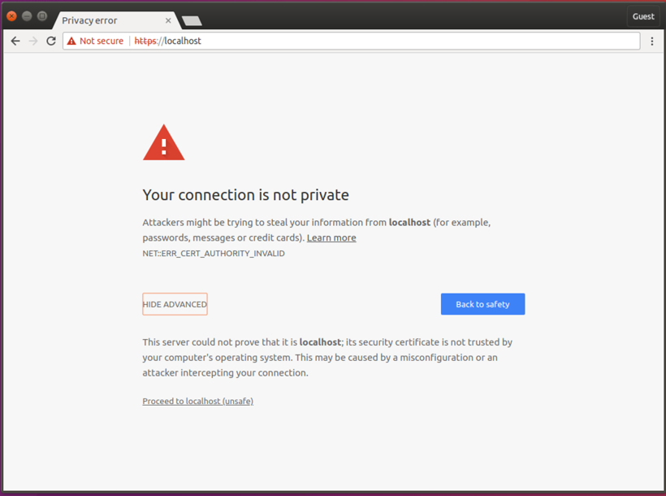
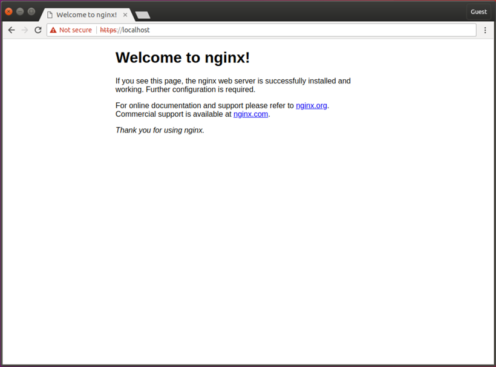
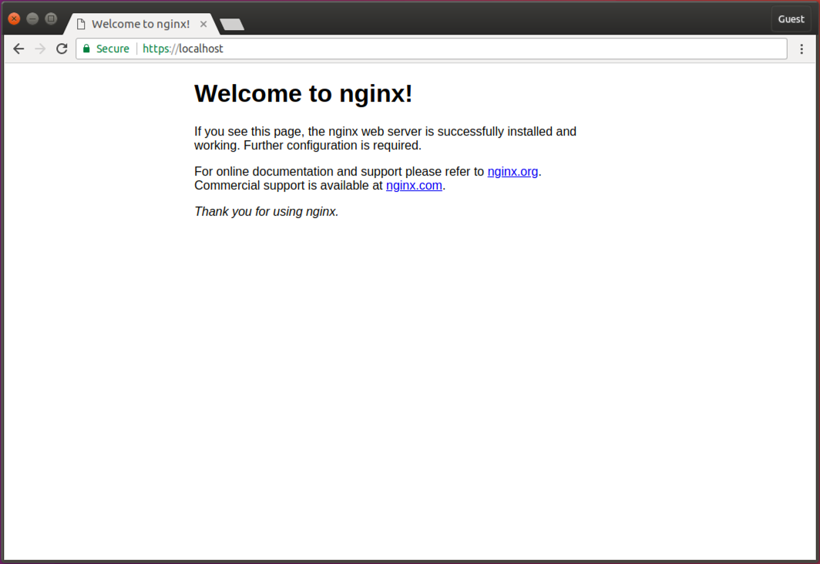

来源：https://www.humankode.com/ssl/create-a-selfsigned-certificate-for-nginx-in-5-minutes


在本教程中，我将向您展示如何创建自签名SSL / TLS证书并在5分钟或更短的时间内在Nginx上使用它。我在本教程中使用Ubuntu，但是如果您使用的是Mac OSX，则可以遵循，因为语法和命令几乎相同。

### 为什么要创建自签名证书？

自签名证书对于要模拟HTTPS环境的本地开发很有用。请注意，自签名证书不是用于生产的，但是它们是本地主机开发的理想选择。

### 创建自签名证书的概述

在继续之前，让我们退后一步，看看为Nginx生成自签名证书所涉及的步骤：

1. 使用OpenSSL生成自签名证书
2. 将证书复制到Ubuntu上的certificates文件夹
3. 更新Nginx配置文件以加载证书
4. 将证书的公钥复制到CA受信任的根数据库中，以防止Google Chrome将网站显示为不安全


### 步骤1：使用OpenSSL生成自签名证书

我将使用OpenSSL在Ubuntu上生成证书。默认情况下，OpenSSL安装在Mac OSX上，命令完全相同。

OpenSSL将生成2个文件，其中包含一个私钥和一个公钥。即使大多数人都以单数形式指代SSL / TLS证书，但构成证书的是私钥和公钥的组合。

在运行OpenSSL命令以生成自签名证书之前，我将创建一个证书配置文件，该文件将指定证书位和主题备用名称。在Google Chrome 58及更高版本中，主题备用名称是必需的，并且用于匹配域名和证书。如果该域名未在证书的“使用者备用名称”列表中列出，您将收到 *NET :: ERR_CERT_COMMON_NAME_INVALID* 错误消息。

创建证书配置文件

```bash
sudo nano localhost.conf
```

```elm
[req]
default_bits       = 2048
default_keyfile    = localhost.key
distinguished_name = req_distinguished_name
req_extensions     = req_ext
x509_extensions    = v3_ca

[req_distinguished_name]
countryName                 = Country Name (2 letter code)
countryName_default         = US
stateOrProvinceName         = State or Province Name (full name)
stateOrProvinceName_default = New York
localityName                = Locality Name (eg, city)
localityName_default        = Rochester
organizationName            = Organization Name (eg, company)
organizationName_default    = localhost
organizationalUnitName      = organizationalunit
organizationalUnitName_default = Development
commonName                  = Common Name (e.g. server FQDN or YOUR name)
commonName_default          = localhost
commonName_max              = 64

[req_ext]
subjectAltName = @alt_names

[v3_ca]
subjectAltName = @alt_names

[alt_names]
DNS.1   = localhost
DNS.2   = 127.0.0.1
```


使用OpenSSL创建证书

```bash
sudo openssl req -x509 -nodes -days 365 -newkey rsa:2048 -keyout localhost.key -out localhost.crt -config localhost.conf
```

 

### 步骤2：将证书密钥对复制到Ubuntu上的Certificates文件夹

将公钥复制到/ etc / ssl / certs目录

```bash
sudo cp localhost.crt /etc/ssl/certs/localhost.crt
```

将私钥复制到/ etc / ssl / private目录

```bash
sudo cp localhost.key /etc/ssl/private/localhost.key
```

 

### 步骤3：更新Nginx配置文件以加载证书密钥对

```bash
sudo nano /etc/nginx/sites-available/default
server {
        listen 80;
        listen 443 ssl http2;
        listen [::]:443 ssl http2;
        server_name localhost;

        ssl_certificate /etc/ssl/certs/localhost.crt;
        ssl_certificate_key /etc/ssl/private/localhost.key;
        
        ssl_protocols TLSv1.2 TLSv1.1 TLSv1;

        root /var/www/html;

        index index.html index.nginx-debian.html;
}
```

重新加载Nginx配置更改

```bash
sudo service nginx reload
```

 

### 打开Chrome浏览器以验证Nginx是否通过HTTP和HTTPS加载了网站

由于我尚未将自签名证书添加到Chrome的CA Root存储区，因此Chrome显示该网站不安全。



Google Chrome浏览器显示该网站不安全

单击继续到Localhost以验证是否正确配置了Nginx



Nginx正在提供自签名证书，但是Google Chrome浏览器显示该网站不安全

### 第4步：将Chrome配置为信任证书并将网站显示为安全

将证书添加到受信任的CA根存储

```bash
certutil -d sql:$HOME/.pki/nssdb -A -t "P,," -n "localhost" -i localhost.crt
```

关闭所有Google Chrome浏览器窗口，然后重新打开。Chrome现在显示该网站为安全网站。



Google Chrome浏览器将网站显示为安全
