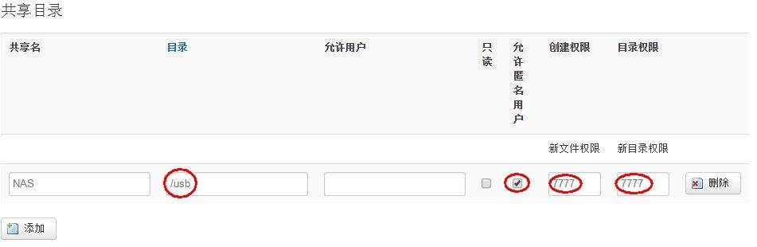

# 网件4300路由器配置

## 一、刷入固件

首先设置电脑IP为192.168.1.2

### 1.1 Win系统下
1. 设置电脑IP为192.168.1.1
2. 关闭防火墙
3. 启一个cmd执行`ping -t 192.168.1.1`，用于监控路由器状态
4. 拿牙签按着路由器上Reset孔不放接通电源
5. 等ping结束正常稳定后松开手
6. 执行 tftp -i 192.168.11.1 put xxx.img
7. 上传完固件等ping结果正常并稳定时关闭路由器电源，然后再打开，据说不这样没有5G的Wifi信号。

### 1.2 Mac系统下

1. 设置电脑IP为192.168.1.2
2. 启一个终端执行`ping 192.168.1.1`，用于监控路由器状态
3. 拿牙签按着路由器上Reset孔不放接通电源
4. 等ping结束正常稳定后松开手
5. 分别执行下面几步：
  ```sh
  tftp
  connect 192.168.1.1 # 连接路由器
  binary # 设置为二进制传输方式
  put xxx.img
  ```
```
7. 上传完固件等ping结果正常并稳定时关闭路由器电源，然后再打开，据说不这样没有5G的Wifi信号。

## 二、安装软件挂载移动硬盘并共享

使用openwrt过程中会用到WinSCP和PuTTY，先自行在网上搜索下载。

1、用PuTTY连接至路由

2、输入以下命令（#号及后面的为注释不要输入）：

​```sh
opkg update # 更新软件列表
opkg install luci-i18n-chinese # 安装中文web界面
opkg install kmod-usb-storage block-mount kmod-fs-ext4 luci-app-samba samba36-client samba36-server hdparm # 安装共享等
reboot # 重启路由
```

3、挂载与共享设置
浏览器输入192.168.1.1进入路由器web界面，点“系统”菜单选择“挂载点”选项


在挂载点页面的挂载点处选择要挂载的硬盘分区，可点“修改”进行相关设置，注意下图中挂载点要显示的目录名称与文件系统格式设置，设置好后注意选择保存。


点“服务”菜单选择“网络共享”选项，在网络共享页面点添加设置共享目录，目录处输入上图中设置的挂载点目录名称，选择允许匿名用户，创建权限和目录权限都设置为7777，选择保存设置完毕。



设置好后用PuTTY连接至路由，用以下命令启动共享
/etc/init.d/samba enable

4、设置usb硬盘自动休眠

在web管理页面点“系统”菜单选择“启动项”选项，在启动项页面的“本地启动脚本”内输入以下命令，使移动硬盘5分钟无操作便进入休眠，休眠时接到读写命令会自动唤醒进入工作模式。

```sh
hdparm -S 60 /dev/sda2    （放到开机启动项就可以每次开机都生效！）
hdparm -y /dev/sda2        (这个命令是立即休眠，测试硬盘是否休眠成功。）
```
注：
`hdparm -S 60 /dev/sda2`，设置超时值(5分钟)使硬盘进入休眠模式（省电模式）(这个 S数值/12=分钟)；
/dev/sda2 为挂载的硬盘路径，`ls /dev/sda*`查看你的盘符。

至此挂载移动硬盘及共享设置全部完成！

## 三、安装aria2下载软件

我最初用的openwrt下载软件是迅雷自家的Xware，后用了arir2发现它各种方便，甩Xware几条街。
1、安装Aria2
```sh
opkg update
opkg install aria2 sudo #安装aria2与sudo
```

2、配置Aria2
Aria2有两种下载模式,一种是命令行下载模式,一种是RPC Server模式.前者不建议使用,后者的使用方式很方便. RPC模式就是启动之后什么也不做,等着通过RPC接口接受下载请求.下载完也不会退出,一直等待. 使用命令行加参数的方式配置Aria2非常不推荐,建议使用配置文件的方式,下面贴出一份配置文件。

```sh
##允许rpc
enable-rpc=true
#允许所有来源, web界面跨域权限需要
rpc-allow-origin-all=true
#允许非外部访问
rpc-listen-all=true
#RPC端口, 仅当默认端口被占用时修改
rpc-listen-port=6800
#设置加密的密钥，token验证
rpc-secret=token
#禁用IPv6, 默认:false
disable-ipv6=true
#最大同时下载数(任务数), 路由建议值: 3
max-concurrent-downloads=3
#断点续传
continue=true
#同服务器连接数
max-connection-per-server=5
#最小文件分片大小, 下载线程数上限取决于能分出多少片, 对于小文件重要
min-split-size=10M
#单文件最大线程数, 路由建议值: 5
split=5
#下载速度限制
max-overall-download-limit=0
#单文件速度限制
max-download-limit=0
#上传速度限制
#max-overall-upload-limit=0
#单文件速度限制
#max-upload-limit=0
#断开速度过慢的连接
#lowest-speed-limit=0
#验证用，需要1.16.1之后的release版本
#referer=*
#日志文件，如果不需要日志，这一行可去掉
#log=/app/aria2/Aria2.log
#这两个是记录和读取下载历史用的，断电和重启时保证下载任务不会丢失，如果有时aria2不能启动，清空这里面的内容就行了
input-file=/app/aria2/aria2.session
save-session=/app/aria2/aria2.session
#定时保存会话，每5分钟自动保存错误或未完成的下载，如果为 0, 只有 aria2 正常退出才回保存，默认 0,需要1.16.1之后的release版
save-session-interval=300
#文件保存路径, 默认为当前启动位置
dir=/usb/Downloads
#文件缓存, 使用内置的文件缓存, 如果你不相信Linux内核文件缓存和磁盘内置缓存时使用, 需要1.16及以上版本
#disk-cache=0
#另一种Linux文件缓存方式, 使用前确保您使用的内核支持此选项, 需要1.15及以上版本(?)
#enable-mmap=true
#文件预分配, 能有效降低文件碎片, 提高磁盘性能. 缺点是预分配时间较长
#所需时间 none < falloc ? trunc << prealloc, falloc和trunc需要文件系统和内核支持
file-allocation=prealloc
```

将上面的配置文件保存为aria2.conf（注意保存时编码选择为ANSI，否则会出现未知错误）,用WinSCP新建/app/aria2目录，并将aria2.conf保持在里面，在/app/aria2新建aria2.session文件（目的请见上面的配置注释）

aria2.session也可在终端用命令建立：
```sh
cd /app/aria2 #进入/app/aria2 目录
touch aria2.session #新建aria2.session文件
```

3、设置开机自启动

在web管理页面点“系统”菜单选择“启动项”选项，在启动项页面的“本地启动脚本”内输入以下命令，设置开机自启动。

sudo -u nobody aria2c –conf-path=/app/aria2/aria2.conf -D

注：以用户nobody运行aria2，以解决aria2下载的文件的权限问题，`-D` 意为后台执行

至此，aira2安装设置已全部完成，aria2下载可使用[迅雷离线导出](https://chrome.google.com/webstore/detail/thunderlixianexporter/kpoolhipjfabknekpkmjncgkaljnjdmn?utm_source=chrome-app-launcher-info-dialog)、[百度网盘助手](https://chrome.google.com/webstore/detail/baiduexporter/mjaenbjdjmgolhoafkohbhhbaiedbkno?utm_source=chrome-app-launcher-info-dialog)、[115下载助手](https://chrome.google.com/webstore/detail/115exporter/ojafklbojgenkohhdgdjeaepnbjffdjf?utm_source=chrome-app-launcher-info-dialog)、[Aria2c Integration](https://chrome.google.com/webstore/detail/aria2c-integration/edcakfpjaobkpdfpicldlccdffkhpbfk?utm_source=chrome-app-launcher-info-dialog)等插件解决，本文不再赘述。

## 四、使用 DnsPod 来实现动态域名解析

使用sddns做为定时更新Dnspod的脚本

下载地址：http://files.vinoca.org/sddns_0.0.9-4_all.tar.gz

```sh
# crontab -e 加入定时任务（每15分钟执行一次）
*/5 * * * * /usr/bin/sddns 2>/dev/null #ddns
```


